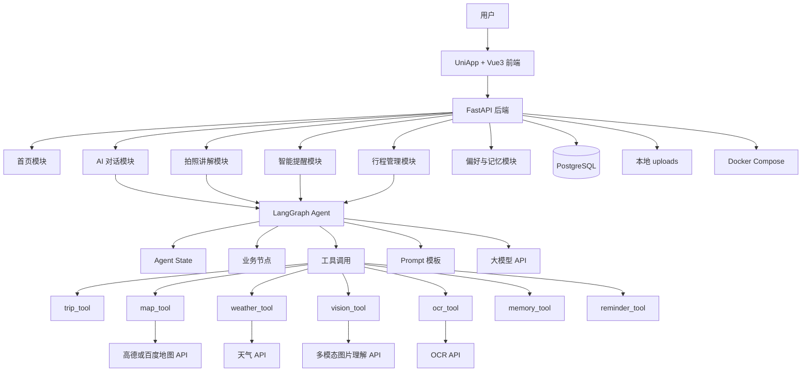
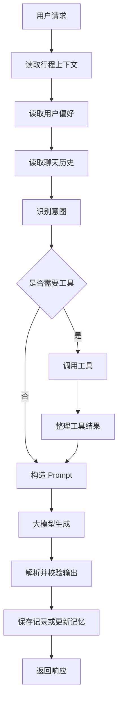
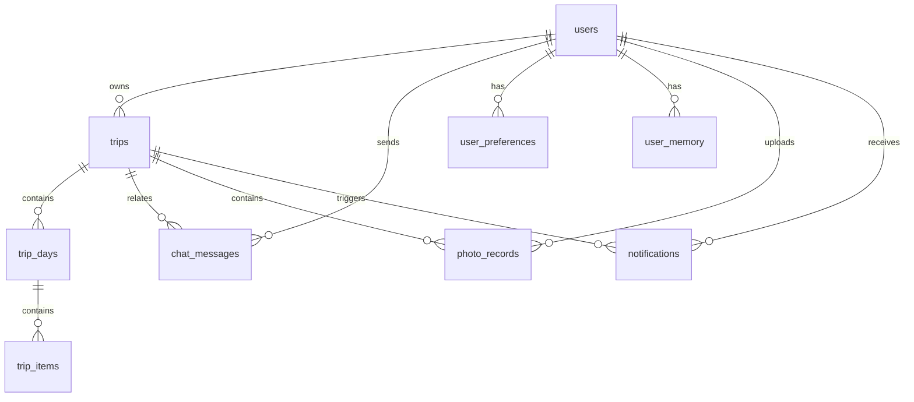

# 《导友》MVP 架构文档

## 1. 总体架构

导友 MVP 采用前后端分离架构，后端统一承接业务 API、数据库访问、文件上传和 Agent 调用。LangGraph Agent 作为智能编排层，不直接暴露给前端。



## 2. 分层职责

| 层级 | 技术 | 职责 |
| --- | --- | --- |
| 前端层 | UniApp + Vue3 | 页面展示、表单交互、图片上传、对话界面 |
| API 层 | FastAPI Router | 请求解析、参数校验、响应封装、依赖注入 |
| 服务层 | Python Service | 行程、图片、提醒、偏好等业务逻辑 |
| 数据层 | SQLAlchemy + PostgreSQL | 权威业务数据存储 |
| Agent 层 | LangGraph | 状态流转、意图识别、工具编排、回复生成 |
| 外部能力层 | LLM、地图、OCR、视觉 API | 提供 MVP 不自研能力 |
| 文件存储 | 本地 `uploads/` | 保存用户上传图片和预留文档、音频 |

## 3. 后端目录架构

```text
backend/
├── pyproject.toml
├── uv.lock
├── app/
│   ├── main.py
│   ├── api/
│   │   ├── health.py
│   │   ├── home.py
│   │   ├── trips.py
│   │   ├── chat.py
│   │   ├── photos.py
│   │   ├── reminders.py
│   │   └── preferences.py
│   ├── core/
│   │   ├── config.py
│   │   ├── errors.py
│   │   ├── logging.py
│   │   └── response.py
│   ├── db/
│   │   ├── session.py
│   │   └── base.py
│   ├── models/
│   ├── schemas/
│   ├── services/
│   └── agent/
└── uploads/
    ├── images/
    ├── docs/
    └── audio/
```

## 4. 后端模块边界

| 模块 | 路由 | Service | 数据表 | 外部依赖 |
| --- | --- | --- | --- | --- |
| 健康检查 | `health.py` | 无 | 无 | 无 |
| 首页 | `home.py` | `home_service.py` | `trips`, `trip_days`, `trip_items`, `notifications` | 无 |
| 行程 | `trips.py` | `trip_service.py` | `trips`, `trip_days`, `trip_items` | Agent 可读取上下文 |
| 对话 | `chat.py` | `chat_service.py` | `chat_messages`, `user_preferences`, `user_memory` | LangGraph、LLM |
| 拍照 | `photos.py` | `photo_service.py`, `file_service.py` | `photo_records` | 视觉 API、OCR、LLM |
| 提醒 | `reminders.py` | `reminder_service.py` | `notifications`, `trip_items` | LangGraph、地图、天气 |
| 改线 | `trips.py` | `replan_service.py` | `trip_items` | LangGraph、地图 |
| 偏好 | `preferences.py` | `preference_service.py` | `user_preferences`, `user_memory` | 可被 Agent 读取 |

## 5. Agent 架构

Agent 不直接面向前端，统一由后端 service 调用。建议目录如下：

```text
backend/app/agent/
├── graph.py
├── state.py
├── nodes.py
├── tools.py
└── prompts.py
```

Agent State 字段：

| 字段 | 含义 |
| --- | --- |
| `user_id` | 当前用户，MVP 默认 1 |
| `trip_id` | 当前旅行 |
| `user_message` | 用户输入 |
| `current_trip` | 当前旅行、行程日和行程项 |
| `current_location` | 经纬度、城市或手动位置 |
| `user_preferences` | 讲解风格、旅行节奏、兴趣偏好 |
| `chat_history` | 最近多轮聊天记录 |
| `image_info` | 上传图片路径、OCR 文本、识别结果 |
| `tool_results` | 工具调用结果 |
| `intent` | `chat`、`photo_explain`、`reminder_check`、`replan` |
| `final_response` | 返回给后端 service 的结构化结果 |

Agent 工作流：



## 6. 数据架构

PostgreSQL 保存长期权威数据，LangGraph State 只保存单次请求内临时状态。



MVP 不引入 Redis。提醒结果、聊天记录、照片记录和改线后的行程变更直接写入 PostgreSQL，保证演示可追溯。

## 7. 文件存储架构

MVP 使用本地目录：

```text
backend/uploads/
├── images/
├── docs/
└── audio/
```

规则：

- 图片讲解只写入 `uploads/images/`。
- 保存文件时生成服务端文件名，不信任用户原始文件名。
- 数据库只保存相对路径。
- 文件类型和大小在后端校验。
- 后续商业化可替换为 MinIO 或云对象存储。

## 8. 请求链路

### 8.1 行程创建链路

```text
前端提交旅行信息
→ FastAPI 校验请求
→ trip_service 创建 trips
→ 创建 trip_days 和 trip_items
→ PostgreSQL 持久化
→ 返回 trip_id
```

### 8.2 AI 对话链路

```text
前端发送 message
→ chat_service 读取 trip、preferences、history
→ 调用 LangGraph Agent
→ Agent 生成回复
→ 保存 user/assistant 两条 chat_messages
→ 返回 reply 和 intent
```

### 8.3 拍照讲解链路

```text
前端上传图片
→ file_service 校验并保存图片
→ photo_service 调用 vision_tool / ocr_tool
→ Agent 结合偏好生成讲解
→ 保存 photo_records
→ 返回 explanation 和 follow_up_questions
```

### 8.4 动态改线链路

```text
用户提出改线
→ replan_service 读取当前行程
→ Agent 生成草案
→ 返回 draft_id 和 new_items
→ 用户确认
→ apply-plan 更新 trip_items
→ 首页重新读取今日行程
```

## 9. 错误处理与降级

| 场景 | 处理方式 |
| --- | --- |
| 请求参数错误 | 返回 `4000`，指出字段问题 |
| 资源不存在 | 返回 `4001` |
| 文件上传失败 | 返回 `4002`，不写入脏记录 |
| 大模型失败 | 返回 `5001` 或 fallback 内容 |
| 地图 API 失败 | 使用演示模拟路线数据 |
| Agent 输出解析失败 | 记录原始输出，返回 `5003` 或 fallback |
| 数据库异常 | 回滚事务，返回 `5000` |

## 10. 部署架构

MVP 使用 Docker Compose 启动 PostgreSQL 和后端服务。前端可独立运行 H5 或小程序调试环境。

```text
docker-compose.yml
├── postgres
└── backend
```

演示前应准备：

- 固定 `.env.example`。
- 默认用户和“大连三日游”种子数据。
- 固定演示图片。
- 大模型和地图 API fallback 数据。

