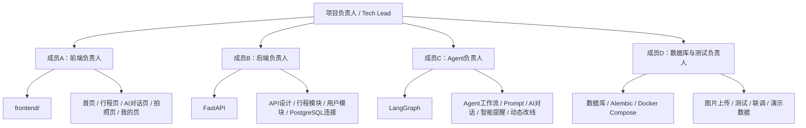
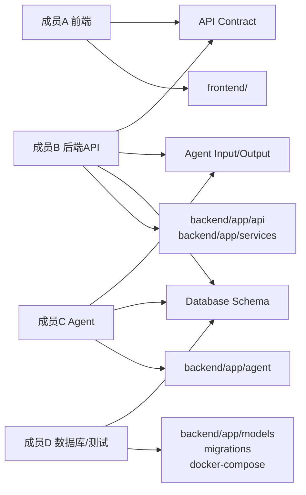
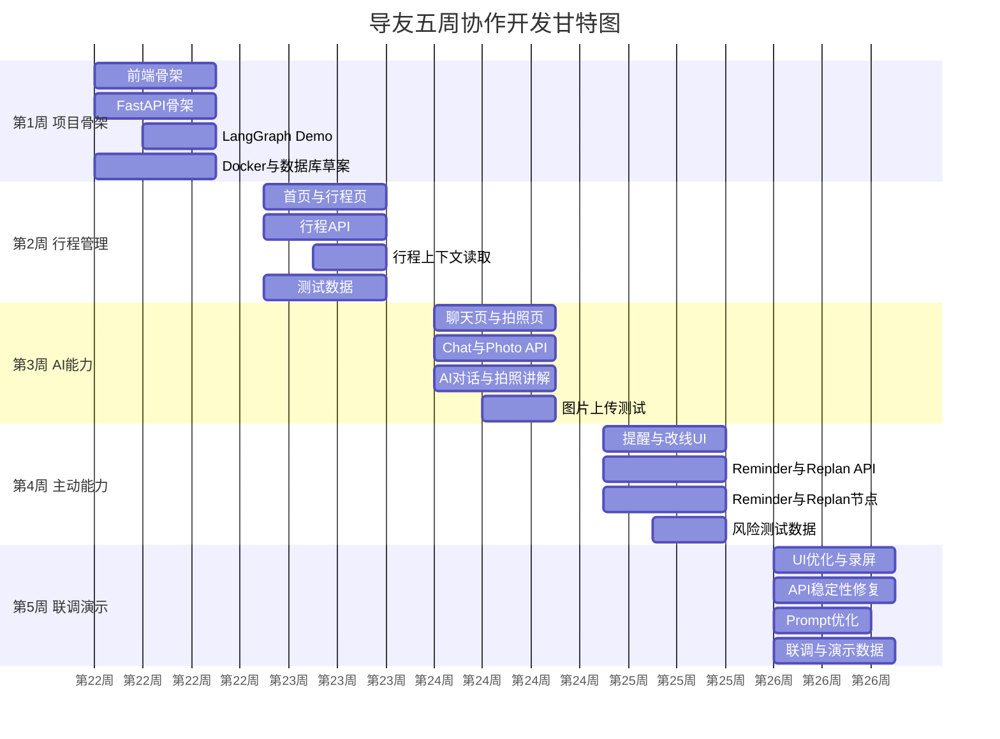

# 《导友——你的个人旅游搭子》团队开发协作与项目管理文档
## 1. 项目总体目标
### 1.1 MVP 目标
《导友》MVP 的目标是在 5 周内完成一个可演示、可联调、可录制复赛视频的主动式旅游陪伴 Agent 原型。

MVP 不追求商业化完整系统，而是优先跑通核心闭环：

1. 用户创建旅行计划。
2. 首页展示今日行程。
3. 用户通过 AI 对话获得旅行建议。
4. 用户上传景点图片，AI 生成讲解。
5. 系统生成智能提醒。
6. 用户提出临时变更，Agent 生成动态改线建议。
7. 用户偏好影响 AI 回复和讲解风格。

### 1.2 核心演示闭环
复赛演示应围绕一条完整路径展开：

```latex
创建“大连三日游”
→ 首页展示今日行程
→ 上传景点图片
→ AI 生成景点讲解
→ 用户追问拍照建议
→ 系统生成出发提醒
→ 用户提出“不想去下一个景点”
→ Agent 生成轻松版路线
→ 用户确认后行程更新
```

### 1.3 复赛交付物
| 交付物 | 说明 |
| --- | --- |
| MVP 可运行系统 | UniApp 前端 + FastAPI 后端 + LangGraph Agent |
| GitHub 仓库 | 代码结构清晰，有 README、提交记录和分支管理 |
| 技术设计文档 | 说明系统架构、Agent、数据库、API |
| 项目管理文档 | 说明团队协作、分工、联调和风险管理 |
| 演示数据 | 默认用户、大连三日游、景点图片、提醒样例 |
| 演示视频 | 录制完整核心闭环 |
| 答辩 PPT | 展示产品价值、技术创新、工程实现 |


### 1.4 成功标准
| 维度 | 成功标准 |
| --- | --- |
| 功能完整性 | 核心 6 个功能模块均可演示 |
| 稳定性 | 演示流程连续运行 5 分钟不崩溃 |
| 协作质量 | GitHub 提交清晰，PR 可追溯 |
| 工程质量 | 前后端目录清楚，接口格式统一 |
| 演示效果 | 评委能看懂“主动式旅游 Agent”的差异化 |
| 时间控制 | 第 5 周完成冻结版本并录制视频 |


---

## 2. 团队组织结构
### 2.1 角色设计


### 2.2 成员职责
| 成员 | 角色 | 核心负责内容 |
| --- | --- | --- |
| 成员 A | 前端负责人 | `frontend/`、首页、行程页、回收站页、AI 对话页、拍照讲解页、我的页面、UI 优化 |
| 成员 B | 后端负责人 | FastAPI、API 设计、行程模块、回收站模块、用户模块、PostgreSQL 连接 |
| 成员 C | Agent 负责人 | LangGraph、Agent 工作流、Prompt、AI 对话、拍照讲解逻辑、智能提醒、动态改线 |
| 成员 D | 数据库与测试负责人 | 数据库设计、Alembic、Docker Compose、图片上传、测试、联调、演示数据 |


### 2.3 RACI 责任矩阵
说明：

+ R：Responsible，直接执行人
+ A：Accountable，最终负责人
+ C：Consulted，需参与讨论
+ I：Informed，需同步进度

| 工作项 | 成员A | 成员B | 成员C | 成员D |
| --- | --- | --- | --- | --- |
| 前端页面开发 | A/R | C | C | I |
| API 规范制定 | C | A/R | C | C |
| 行程管理模块 | R | A/R | C | C |
| 回收站模块 | R | A/R | I | R |
| AI 对话模块 | R | C | A/R | C |
| 拍照讲解模块 | R | C | A/R | R |
| 智能提醒模块 | C | R | A/R | C |
| 动态改线模块 | R | C | A/R | C |
| 数据库表设计 | I | C | C | A/R |
| Alembic 迁移 | I | C | I | A/R |
| Docker Compose | I | C | I | A/R |
| 测试用例 | C | C | C | A/R |
| 演示数据 | C | C | C | A/R |
| 复赛视频录制 | R | C | C | A/R |
| 答辩技术讲解 | I | R | A/R | C |


---

## 3. GitHub 协作规范
### 3.1 仓库结构
```latex
duyou/
├── docs/
├── frontend/
├── backend/
└── docker-compose.yml
```

### 3.2 目录负责人
| 目录 | 主要负责人 | 协作成员 | 说明 |
| --- | --- | --- | --- |
| `docs/` | 成员D | 全体 | 技术文档、API 文档、演示脚本、会议记录 |
| `frontend/` | 成员A | 成员B、C | UniApp + Vue3 前端工程 |
| `backend/` | 成员B | 成员C、D | FastAPI 后端工程 |
| `backend/app/agent/` | 成员C | 成员B | LangGraph Agent、Prompt、工具 |
| `backend/app/models/` | 成员D | 成员B | SQLAlchemy 模型 |
| `backend/app/api/` | 成员B | 成员C | REST API 路由 |
| `backend/app/services/` | 成员B | 成员C、D | 行程、回收站、文件和其他业务服务 |
| `backend/uploads/` | 成员D | 成员B | 本地上传文件目录 |
| `docker-compose.yml` | 成员D | 成员B | PostgreSQL、后端服务启动 |


### 3.3 分支策略
```latex
main
develop
feature/frontend
feature/backend
feature/agent
feature/database
```

| 分支 | 用途 | 合并规则 |
| --- | --- | --- |
| `main` | 稳定演示版本 | 只从 `develop` 合并，必须全员确认 |
| `develop` | 日常集成分支 | 所有 feature 分支通过 PR 合并 |
| `feature/frontend` | 前端开发 | 成员A负责，成员B/C按接口协助 |
| `feature/backend` | 后端 API 开发 | 成员B负责 |
| `feature/agent` | Agent 和 AI 能力 | 成员C负责 |
| `feature/database` | 数据库、迁移、测试数据 | 成员D负责 |


### 3.4 合并时机
| 场景 | 合并目标 |
| --- | --- |
| 单个模块功能完成并自测通过 | feature → develop |
| 每周阶段验收通过 | develop 保持可运行 |
| 复赛演示版本冻结 | develop → main |
| 紧急修复演示 Bug | hotfix 分支 → develop → main |


### 3.5 Review 负责人
| PR 类型 | Review 人 |
| --- | --- |
| 前端 PR | 成员A 自查 + 成员B 确认接口 |
| 后端 API PR | 成员B 自查 + 成员A 确认前端兼容 |
| Agent PR | 成员C 自查 + 成员B 确认接口输入输出 |
| 数据库 PR | 成员D 自查 + 成员B 确认模型兼容 |
| release PR | 全员 Review |


### 3.6 Commit 规范
格式：

```latex
type(scope): description
```

类型：

```latex
feat: 新功能
fix: 修复问题
refactor: 重构，不改变行为
docs: 文档
test: 测试
chore: 工程配置、依赖、脚本
```

示例：

```latex
feat(frontend): add trip timeline page
feat(api): add create trip endpoint
feat(agent): add chat replan action options
fix(photo): handle empty image upload
refactor(db): split trip models
docs(api): update chat endpoint contract
test(trip): add trip api test cases
chore(docker): add postgres service
```

### 3.7 Pull Request 模板
```markdown
## PR 类型

- [ ] feat
- [ ] fix
- [ ] refactor
- [ ] docs
- [ ] test
- [ ] chore

## 修改内容

简要说明本次 PR 做了什么。

## 影响范围

- 前端：
- 后端：
- Agent：
- 数据库：
- 文档：

## 自测结果

- [ ] 本地启动通过
- [ ] 接口测试通过
- [ ] 前端页面无明显报错
- [ ] 不影响已有演示流程

## 截图或接口示例

如有 UI 或 API 返回，请贴截图或 JSON。

## 需要 Review 关注的问题

列出不确定点或希望重点检查的地方。
```

### 3.8 Review 流程
1. 提交 PR 前先拉取最新 `develop`。
2. 本地运行相关模块，确认无明显错误。
3. 填写 PR 模板。
4. 指定对应 Reviewer。
5. Reviewer 检查接口、目录、命名、是否影响他人模块。
6. 修改意见解决后再合并。
7. 合并后负责人通知群内同步。

### 3.9 Merge 条件
PR 必须满足：

+ 没有明显冲突。
+ 不直接提交到 `main`。
+ 至少 1 人 Review 通过。
+ 涉及 API 变化时，前后端都确认。
+ 涉及数据库变化时，必须有 Alembic 迁移说明。
+ 不破坏当前核心演示流程。

---

## 4. API 协作规范
### 4.1 为什么必须先定 API 再写代码
前后端并行开发时，最大风险是接口频繁变化。前端不知道字段名，后端不知道页面需要什么，Agent 不知道上下文格式，最终会在联调阶段集中爆发。

因此本项目必须先定 API 合同，再分别开发：

+ 前端按 API Mock 开发页面。
+ 后端按 API 文档实现接口。
+ Agent 按固定输入输出接入后端。
+ 测试按 API 文档写用例。

### 4.2 统一请求格式
普通 JSON 请求：

```json
{
  "user_id": 1,
  "trip_id": 1,
  "message": "下午我想轻松一点"
}
```

文件上传请求使用：

```latex
multipart/form-data
```

例如：

```latex
POST /api/photos/explain
user_id=1
trip_id=1
image=<file>
```

### 4.3 统一返回格式
```json
{
  "code": 0,
  "message": "success",
  "data": {}
}
```

成功示例：

```json
{
  "code": 0,
  "message": "success",
  "data": {
    "trip_id": 1
  }
}
```

失败示例：

```json
{
  "code": 4001,
  "message": "trip not found",
  "data": null
}
```

### 4.4 错误码规范
| code | 含义 |
| --- | --- |
| 0 | 成功 |
| 4000 | 请求参数错误 |
| 4001 | 资源不存在 |
| 4002 | 文件上传失败 |
| 5000 | 后端服务错误 |
| 5001 | 大模型调用失败 |
| 5002 | 地图 API 调用失败 |
| 5003 | Agent 输出解析失败 |


### 4.5 前端如何 Mock
前端在后端未完成时使用 Mock 数据：

```latex
frontend/api/mock/
├── home.ts
├── trips.ts
├── trash.ts
├── chat.ts
├── photos.ts
└── reminders.ts
```

Mock 原则：

+ 字段名必须和 API 文档一致。
+ 不为了页面方便临时改字段。
+ API 确认后再切换真实请求。
+ 每次 API 变化，成员A和成员B必须同步确认。

### 4.6 后端如何保证接口兼容
后端应遵守：

+ 已被前端使用的字段不随意删除。
+ 字段改名必须提前通知。
+ 新增字段可以兼容旧前端。
+ 删除接口必须经过全员确认。
+ `DELETE /api/trips/{trip_id}` 只将旅行移入回收站，永久删除和清空操作必须通过独立的 `/api/trash/trips` 资源完成。
+ 永久删除和清空回收站必须校验用户所有权，只能处理已进入回收站的旅行，并明确提示操作不可恢复。
+ 所有接口在 Swagger 中可查看。
+ 关键接口提供固定示例数据。

---

## 5. 数据库协作规范
### 5.1 数据库表范围
MVP 至少包含：

```latex
users
trips
trip_days
trip_items
chat_messages
user_preferences
user_memory
photo_records
notifications
```

### 5.2 数据库表设计流程
1. 成员D提出表结构草案。
2. 成员B确认是否满足 API。
3. 成员C确认是否满足 Agent 上下文。
4. 成员A确认前端展示字段是否足够。
5. 成员D创建 SQLAlchemy Model。
6. 成员D生成 Alembic migration。
7. 合并到 `feature/database`。
8. 通过 PR 合并到 `develop`。

### 5.3 谁可以修改表结构
| 修改类型 | 负责人 |
| --- | --- |
| 新增表 | 成员D 发起，全员确认 |
| 新增字段 | 成员D 发起，相关模块负责人确认 |
| 删除字段 | 原则上禁止，必须全员确认 |
| 修改字段类型 | 高风险，必须说明兼容方案 |
| 新增索引 | 成员D 和成员B确认 |
| 修改初始数据 | 成员D负责 |


### 5.4 Alembic 管理规范
+ 所有表结构变更必须通过 Alembic。
+ 不允许手动修改数据库后不提交迁移。
+ migration 文件命名要说明目的。
+ 每个 PR 最多包含一组相关迁移。
+ 合并前必须本地执行升级成功。

示例：

```latex
alembic revision --autogenerate -m "add trip tables"
alembic upgrade head
```

### 5.5 避免数据库冲突
+ 同一时间只允许成员D主导数据库结构变更。
+ 成员B/C需要字段时，先提 issue 或在群里说明。
+ 不在业务代码里临时依赖不存在字段。
+ `develop` 合并数据库迁移后，全员立即同步并执行 upgrade。
+ 演示前 3 天冻结表结构，除非严重 Bug。

---

## 6. 四人并行开发方案
### 6.1 为什么不能四个人同时随意写代码
四个人同时随意写代码会导致：

+ 多人修改同一个文件，Git 冲突频繁。
+ 前端字段和后端字段不一致。
+ Agent 输入输出无法被 API 正确消费。
+ 数据库结构被重复修改。
+ 最后联调时问题集中爆发，无法定位责任。
+ 演示前系统不稳定。

因此必须按模块边界并行开发。

### 6.2 模块边界图


### 6.3 第一阶段：项目骨架
目标：项目可以启动。

| 成员 | 任务 |
| --- | --- |
| 成员A | 初始化 UniApp 前端骨架，创建首页、行程页、聊天页、拍照页、我的页空页面 |
| 成员B | 初始化 FastAPI 项目，完成 `/health`，配置 uv |
| 成员C | 初始化 LangGraph Demo，完成固定输入输出的 Agent 节点 |
| 成员D | 完成数据库表草案、Docker Compose、PostgreSQL 启动和种子数据准备 |


验收：

+ `frontend/` 可以启动。
+ `backend/` 可以启动。
+ `/health` 返回 success。
+ PostgreSQL 可连接。
+ Agent Demo 可返回固定回复。

### 6.4 第二阶段：行程管理
目标：首页展示今日行程，并完成旅行回收站闭环。

| 成员 | 任务 |
| --- | --- |
| 成员A | 开发首页时间轴、行程页和回收站页，先接 Mock 数据 |
| 成员B | 实现 trip、trip_day、trip_item API，以及独立的 trash API 和 service |
| 成员C | 实现 Agent 读取行程上下文方法 |
| 成员D | 增加 `trips.deleted_at` 和级联删除迁移，准备回收站测试数据，测试行程与回收站 API |


验收：

+ 可创建旅行。
+ 可新增行程节点。
+ 可将旅行移入回收站、恢复旅行、永久删除旅行和清空回收站。
+ 永久删除和清空回收站不会影响正常旅行或其他用户的数据。
+ 首页显示今日行程。
+ Agent 可以读取当前 trip 上下文。

### 6.5 第三阶段：AI 对话与拍照讲解
目标：完成 AI 对话和图片讲解。

| 成员 | 任务 |
| --- | --- |
| 成员A | 开发 AI 对话页、拍照讲解页、消息气泡、图片上传交互 |
| 成员B | 实现 `/api/chat`、`/api/chat/history`、`/api/photos/explain` |
| 成员C | 实现 chat node、photo explain node、Prompt、LLM 调用 |
| 成员D | 实现图片保存到 uploads，准备测试图片，测试接口稳定性 |


验收：

+ 用户可发送消息并获得 AI 回复。
+ 聊天记录保存成功。
+ 用户上传图片后生成讲解。
+ 拍照讲解结果可在前端展示。

### 6.6 第四阶段：智能提醒与动态改线
目标：完成 Agent 主动能力演示。

| 成员 | 任务 |
| --- | --- |
| 成员A | 开发提醒展示、Chat 改线选项选择交互、首页刷新 |
| 成员B | 实现 `/api/reminders/check`、`/api/reminders`，扩展 `/api/chat` 返回 `action_options`，保证 `PUT /api/trip-items/{item_id}` 可应用选项 |
| 成员C | 实现 reminder node、Chat 内改线意图分支、地图工具封装、提醒和改线 Prompt |
| 成员D | 准备时间冲突和出发提醒测试数据，验证选项结构和节点更新后的数据库状态 |


验收：

+ 点击检查风险后生成提醒。
+ 用户提出改线需求后，Chat 返回合法的 `action_options`。
+ 用户选择选项后，通过行程节点更新接口完成修改。
+ 首页能展示更新后的行程。

### 6.7 第五阶段：联调与演示
目标：冻结 MVP，录制演示视频。

| 成员 | 任务 |
| --- | --- |
| 成员A | UI 优化，修复页面显示问题，负责 APP 操作录屏 |
| 成员B | 修复 API Bug，保证后端稳定 |
| 成员C | 优化 Prompt，准备 AI fallback 内容 |
| 成员D | 组织联调，准备演示数据，记录 Bug，负责 Docker 启动脚本 |


验收：

+ 核心演示流程完整跑通。
+ `main` 分支有可演示版本。
+ 演示视频录制完成。
+ 答辩 PPT 和讲解分工完成。

---

## 7. GitHub 开发时间线
| Commit | 负责人 | 提交文件 | 目标 |
| --- | --- | --- | --- |
| #1 init project structure | 成员D | `docs/`, `frontend/`, `backend/`, `docker-compose.yml`, `README.md` | 建立仓库骨架 |
| #2 add api/database/agent docs | 成员B、C、D | `docs/api.md`, `docs/database.md`, `docs/agent.md` | 固定 API、数据库、Agent 协议 |
| #3 init fastapi backend | 成员B | `backend/pyproject.toml`, `backend/app/main.py`, `backend/app/core/` | 后端可启动，`/health` 可访问 |
| #4 add database models | 成员D | `backend/app/models/`, `migrations/` | 建立数据库模型和迁移 |
| #5 init frontend pages | 成员A | `frontend/pages/`, `frontend/components/`, `frontend/api/` | 前端页面骨架完成 |
| #6 init langgraph agent | 成员C | `backend/app/agent/graph.py`, `state.py`, `nodes.py`, `prompts.py` | Agent 最小闭环完成 |
| #7 complete trip and trash modules | 成员A、B、D | 行程 API、回收站 API、首页、行程页、回收站页、迁移、测试数据 | 首页展示今日行程，回收站可删除和恢复 |
| #8 complete chat module | 成员A、B、C | `/api/chat`, 聊天页, chat node | AI 对话可演示 |
| #9 complete photo explanation module | 成员A、C、D | 图片上传、拍照页、photo node、uploads | 上传图片后生成讲解 |
| #10 complete replanning module | 成员A、B、C | Chat 改线意图、`action_options`、节点更新确认交互 | 动态改线可演示 |
| #11 complete reminder module | 成员A、B、C、D | reminder API、提醒页、测试数据 | 智能提醒可演示 |
| #12 ui optimization | 成员A | 前端样式、交互细节、演示动线 | 提升视频观感 |
| #13 demo release | 全员 | README、演示数据、release tag | 冻结复赛演示版本 |


---

## 8. 每周开发计划
| 周次 | 成员A | 成员B | 成员C | 成员D | 验收目标 |
| --- | --- | --- | --- | --- | --- |
| 第1周 | 前端骨架、页面路由 | FastAPI 骨架、健康检查 | LangGraph Demo | Docker、数据库草案 | 项目可启动 |
| 第2周 | 首页、行程页 | 行程 API | 读取行程上下文 | 测试数据、迁移 | 首页展示今日行程 |
| 第3周 | 聊天页、拍照页 | chat/photo API | AI 对话、拍照讲解 Prompt | 图片上传测试 | AI 对话和拍照讲解可演示 |
| 第4周 | 提醒 UI、Chat 改线选项交互 | reminder API、Chat action options、节点更新接口 | reminder node、Chat 改线意图分支 | 风险和改线测试数据 | 智能提醒和动态改线可演示 |
| 第5周 | UI 优化、录屏操作 | API 稳定性修复 | Prompt 优化、fallback | 联调、Bug、演示数据 | 完成视频和复赛版本 |




---

## 9. 联调流程
### 9.1 第一次联调：第2周末
目标：验证前后端基础闭环。

检查内容：

+ 前端能请求后端。
+ `/health` 正常。
+ 行程列表、行程详情、首页今日行程接口可用。
+ PostgreSQL 数据写入正常。
+ PostgreSQL 数据写入和查询正常。

定位问题方法：

+ 前端查看控制台和 Network。
+ 后端查看 FastAPI 日志。
+ 数据库用管理工具或 SQL 检查数据。
+ 先确认请求参数，再确认后端逻辑。

输出：

+ 第一版 Bug List。
+ API 字段修正清单。
+ 第二阶段验收记录。

### 9.2 第二次联调：第4周中
目标：验证 AI 能力和 Agent 链路。

检查内容：

+ `/api/chat` 能返回 AI 回复。
+ `/api/photos/explain` 能保存图片并返回讲解。
+ Agent 能读取行程上下文。
+ Prompt 输出格式可被后端解析。
+ 图片上传失败时有错误提示。

定位问题方法：

+ Agent 输出原始日志保留。
+ 大模型调用失败时记录 request id 或错误信息。
+ 判断问题属于前端展示、后端接口、Agent 输出还是外部 API。
+ 对不稳定 AI 输出增加 fallback。

输出：

+ Agent 问题清单。
+ Prompt 修改记录。
+ AI fallback 策略。

### 9.3 最终联调：第5周
目标：验证复赛演示全链路。

检查内容：

+ 从创建旅行到动态改线完整跑通。
+ 演示数据稳定。
+ 页面无明显错位。
+ 后端接口响应时间可接受。
+ 大模型失败时不影响录制。
+ `main` 分支可直接运行。

### 9.4 如何回滚
回滚原则：

+ 小问题在当前分支修复。
+ 严重破坏演示流程的 PR 立即 revert。
+ `main` 分支只保留稳定版本。
+ 演示前一天禁止合并大改动。

回滚命令示例：

```latex
git revert <commit_id>
```

### 9.5 如何记录 Bug
建议使用 GitHub Issues。

Bug 模板：

```markdown
## 问题描述

## 复现步骤

1.
2.
3.

## 期望结果

## 实际结果

## 截图或日志

## 负责人

## 优先级

- [ ] P0 阻塞演示
- [ ] P1 影响核心功能
- [ ] P2 普通问题
- [ ] P3 优化建议
```

---

## 10. 风险管理
| 风险 | 等级 | 概率 | 解决方案 |
| --- | --- | --- | --- |
| API 字段频繁变化 | 高 | 高 | 先定 API 文档，变更必须同步前后端 |
| 前后端联调太晚 | 高 | 中 | 第2周末必须第一次联调 |
| Prompt 输出不稳定 | 高 | 高 | 使用 JSON 格式约束，增加解析失败 fallback |
| Agent 输出格式错误 | 高 | 中 | 后端做 schema 校验和重试 |
| 数据库迁移失败 | 高 | 中 | Alembic 统一由成员D管理 |
| 多人修改同一文件冲突 | 中 | 高 | 按目录分工，PR 小步提交 |
| 图片上传失败 | 中 | 中 | 限制文件大小，保存前校验类型 |
| 图片识别失败 | 中 | 高 | 准备固定演示图片和备用识别结果 |
| 大模型限流 | 高 | 中 | 准备 API 额度，增加本地 fallback 文案 |
| 大模型响应慢 | 中 | 高 | 演示时使用较短 Prompt 和本地 fallback 样例 |
| 地图 API 异常 | 中 | 中 | 准备模拟路线数据 |
| 临时状态丢失 | 中 | 低 | Demo 不依赖跨请求缓存，权威数据写入 PostgreSQL |
| PostgreSQL 连接失败 | 高 | 低 | Docker Compose 固定配置，提前测试 |
| 成员时间冲突 | 高 | 中 | 每周明确最低交付，关键任务双人备份 |
| UI 来不及优化 | 中 | 中 | 优先核心页面，减少非必要动画 |
| Docker 环境不一致 | 中 | 中 | README 写清启动步骤 |
| 录制视频时网络不稳 | 高 | 中 | 提前录制，准备 fallback 数据 |
| 演示数据缺失 | 高 | 中 | 成员D负责固定种子数据 |
| 需求过度扩张 | 高 | 高 | 只做 MVP 核心闭环，扩展放到后续 |
| main 分支被破坏 | 高 | 低 | main 只从 develop 合并，演示前冻结 |


---

## 11. MVP 验收标准
| 功能 | 验收标准 |
| --- | --- |
| 项目启动 | Docker Compose 可启动 PostgreSQL，后端可运行 |
| 健康检查 | `GET /health` 返回 success |
| 行程管理 | 能创建、查看、修改旅行和行程节点，删除旅行时进入回收站 |
| 回收站 | 能查询、恢复、永久删除单条旅行和清空当前用户回收站 |
| 首页展示 | 能展示今日行程时间轴 |
| AI 对话 | 能结合当前行程回答问题 |
| 聊天记录 | 用户消息和 AI 回复能保存并查询 |
| 拍照讲解 | 上传图片后生成景点讲解 |
| 图片存储 | 图片能保存到 `uploads/images/` |
| 用户偏好 | 能设置讲解风格、旅行节奏、兴趣偏好 |
| 个性化讲解 | AI 回复能体现用户偏好 |
| 智能提醒 | 能生成出发提醒或时间冲突提醒 |
| 动态改线 | Chat 能识别改线意图并返回可校验的 `action_options` |
| 行程更新 | 用户选择选项后通过 `PUT /api/trip-items/{item_id}` 更新，首页展示最新行程 |
| 错误处理 | AI 或图片接口失败时前端有提示 |
| 演示闭环 | 复赛演示路径可完整跑通 |


---

## 12. 复赛演示责任分工
### 12.1 推荐分工
| 任务 | 负责人 | 说明 |
| --- | --- | --- |
| APP 操作 | 成员A | 熟悉前端页面和演示节奏 |
| AI 演示 | 成员C | 负责解释 Agent、Prompt、LangGraph |
| 技术讲解 | 成员B | 讲解 FastAPI、API、系统架构 |
| PPT 讲解 | 成员A 或项目负责人 | 讲产品背景、用户痛点、核心流程 |
| 答辩问题 | 成员B、C 主答，D 补充 | 技术问题由 B/C 回答，工程和测试由 D 回答 |
| 演示环境 | 成员D | 提前启动 Docker、准备数据、检查网络 |
| 备用方案 | 成员D | 准备录屏、截图、fallback 数据 |


### 12.2 演示当天流程
1. 成员D提前 30 分钟启动后端和数据库。
2. 成员A检查前端页面和演示账号。
3. 成员C检查大模型 API、Prompt 和 fallback。
4. 成员B检查关键 API。
5. 正式演示由成员A操作 APP。
6. 成员C在拍照讲解、智能提醒、动态改线环节补充 Agent 说明。
7. 成员B解释后端架构和接口稳定性。
8. 成员D在答辩中补充数据库、测试和部署方案。

### 12.3 答辩推荐话术重点
+ 我们没有做一个普通攻略工具，而是做主动式旅游陪伴 Agent。
+ MVP 使用轻量架构，适合 4 人 5 周完成。
+ LangGraph 负责 Agent 状态流转和节点编排。
+ 前后端通过固定 API 合同并行开发。
+ 本地 uploads 替代 MinIO，是为了降低 MVP 部署复杂度。
+ 后续可以扩展真实推送、ASR、TTS、MinIO、AR 和景区 B 端后台。
