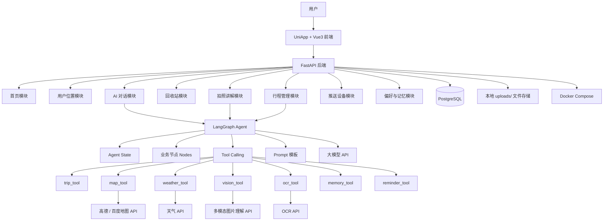
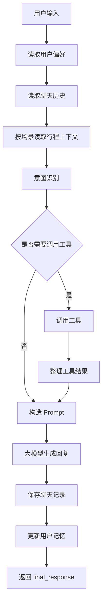
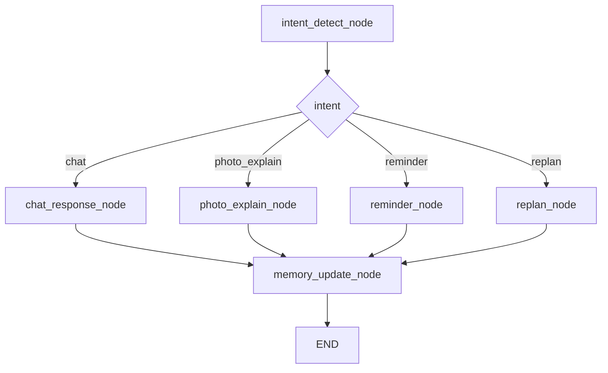
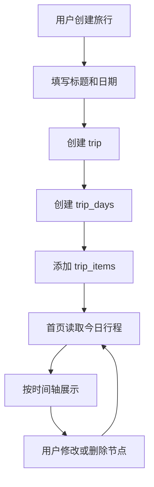
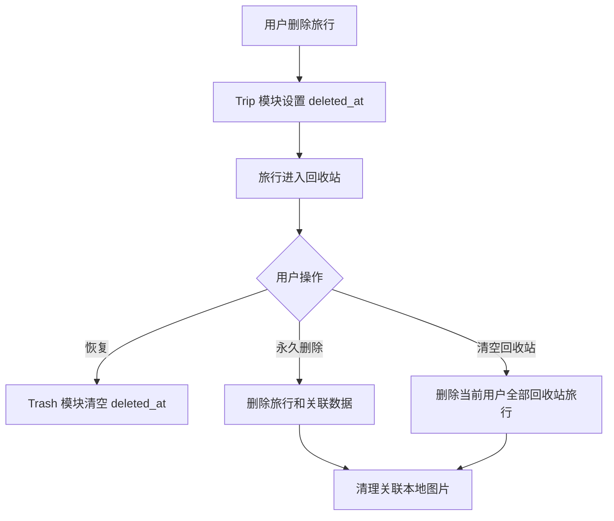
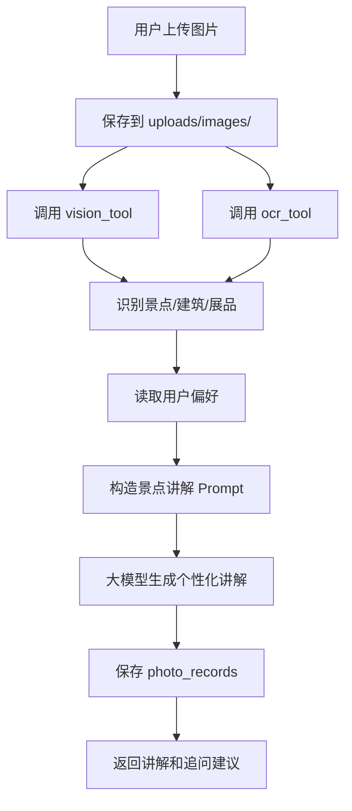
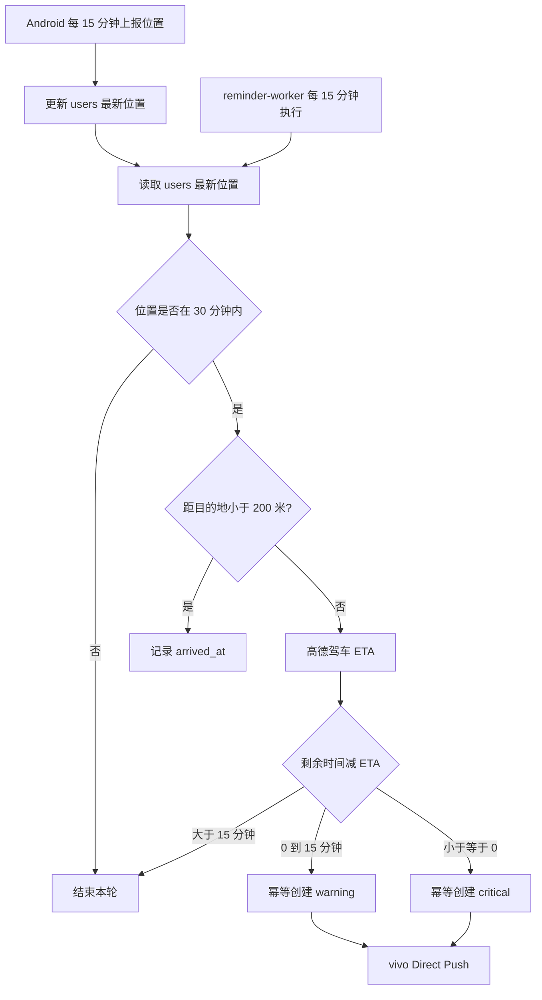
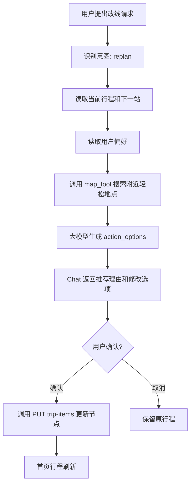
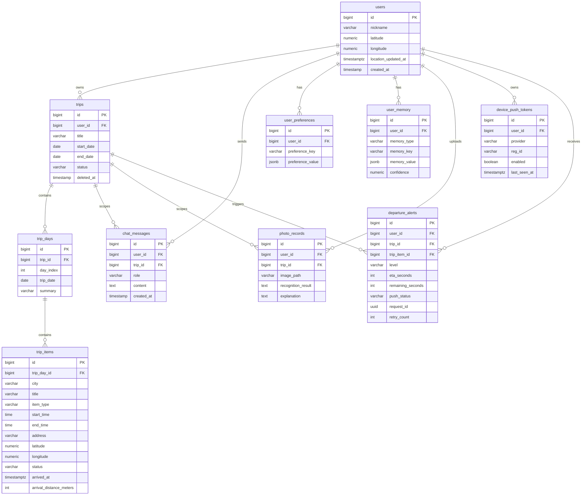
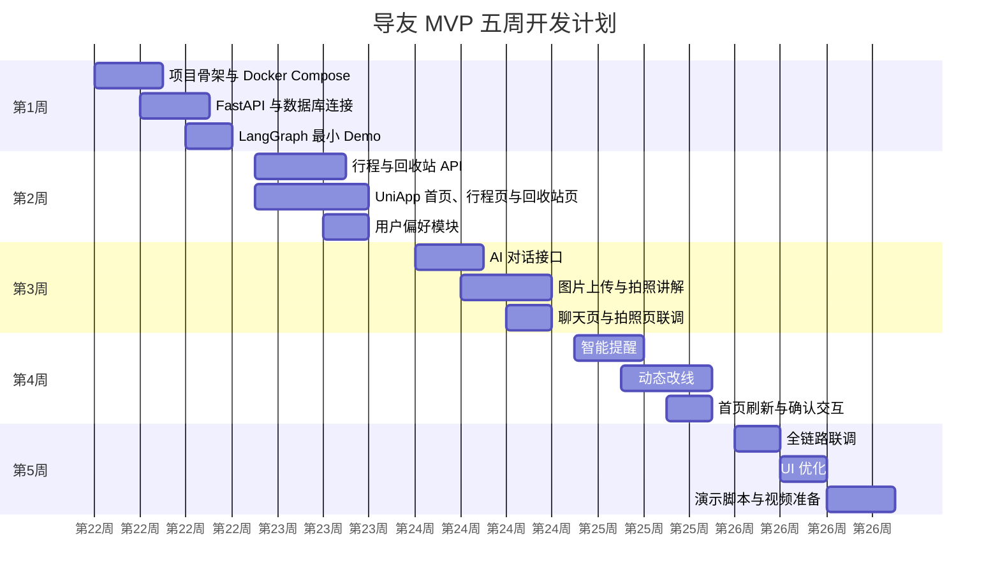

# 《导友——你的个人旅游搭子》MVP 技术设计文档
面向：2026 中国高校计算机大赛 AIGC 创新赛复赛  
作品名称：《导友——你的个人旅游搭子》  
技术定位：基于大模型与 LangGraph 的主动式旅游陪伴 Agent  
版本：MVP V1.0  

---

## 1. 项目概述
### 1.1 项目背景
《导友》是一款面向旅行全过程的主动式旅游陪伴 Agent。它不是普通旅游攻略工具，也不是单纯的 OTA AI 问答助手，而是一个能够理解用户行程、当前位置、偏好和临时需求的“个人旅游搭子”。

传统旅游产品主要解决行前搜索和交易问题，例如查攻略、订酒店、买门票、生成路线。用户真正开始旅行后，仍然需要自己判断时间是否来得及、景点是否值得看、天气变化是否影响路线、下一站是否需要调整。景区导览工具则多是二维码讲解或固定音频，内容静态、无法互动，也无法根据用户兴趣调整讲解方式。

导友希望解决的是旅行中的连续陪伴问题：用户出发前可以创建计划，旅行中可以随时问 AI、上传图片让 AI 讲解景点，系统也能根据行程时间给出提醒。当用户临时改变想法时，Agent 能够根据当前计划、位置、偏好和地图信息生成新的行程建议。

### 1.2 产品定位
导友的产品定位是：

> 基于大模型的主动式旅游陪伴 Agent，为用户提供行前计划、行中陪伴、拍照讲解、智能提醒、动态改线和个性化记忆能力。
>

核心能力包括：

1. 用户创建旅行计划。
2. AI 根据计划进行对话式陪伴。
3. 用户上传图片后，AI 进行景点、建筑、展品或文字讲解。
4. Agent 根据行程时间给出智能提醒。
5. 用户提出临时变更时，AI 生成新的行程建议。
6. 系统记录用户偏好，用于个性化讲解和后续推荐。

### 1.3 目标用户
| 用户类型 | 典型特征 | 核心需求 |
| --- | --- | --- |
| 自由行青年 | 大学生、年轻白领、周末游用户 | 快速制定行程、拍照讲解、灵活改线 |
| 亲子游家庭 | 家长带儿童出游 | 讲解通俗有趣、节奏舒适、安全提醒 |
| 银发文化游用户 | 中老年文化旅行者 | 操作简单、少步行、讲解清晰、提醒及时 |
| 个性化旅游用户 | 喜欢深度体验或小众路线 | 根据兴趣生成专属讲解与建议 |


### 1.4 核心场景
**场景一：创建旅行计划**  
用户在 App 中创建“大连三日游”，填写日期、城市和每天想去的景点。系统生成首页时间轴，用户可以看到今天的行程安排。

**场景二：AI 对话陪伴**  
用户问“今天下午怎么安排比较轻松？”后端读取当前行程和用户偏好，Agent 生成像旅游搭子一样的建议，而不是泛泛回答旅游百科。

**场景三：拍照讲解**  
用户上传“渔人码头”照片，系统保存到 `uploads/images/`，调用多模态图片理解或 OCR，识别景点后生成个性化讲解，并允许用户继续追问“这里怎么拍照好看？”

**场景四：智能提醒**  
Android 定期上报用户最新位置，后台提醒 Worker 结合下一站时间、天气和路线生成主动提醒；用户也可以点击“检查行程风险”手动触发同一套规则。

**场景五：动态改线**  
用户说“我有点累，不想去下一个景点了，帮我换一个轻松点的安排。”Agent 识别意图，读取当前行程和偏好，调用地图工具查找附近地点，生成替代方案，用户确认后更新行程。

### 1.5 MVP 建设目标
MVP 版本的目标不是做完整商业化旅游平台，而是在 1-2 个月内跑通复赛演示闭环：

+ 完成 UniApp + FastAPI 前后端基本工程。
+ 完成 PostgreSQL、uploads 本地文件存储。
+ 完成 LangGraph Agent 最小工作流。
+ 完成行程管理、AI 对话、拍照讲解、智能提醒、动态改线、用户偏好。
+ 保证复赛现场可以稳定演示“行前计划 + 行中陪伴 + 拍照讲解 + 多轮对话 + 智能提醒 + 动态改线”。

### 1.6 复赛演示目标
复赛演示需要让评委清楚看到三个层次：

1. 产品价值：导友不是静态攻略，而是主动陪伴用户旅行。
2. 技术能力：系统使用 LangGraph 编排 Agent 状态、工具和记忆。
3. 落地能力：架构轻量，大学生团队能在短周期内实现。

---

## 2. MVP 系统总体架构
### 2.1 系统架构图


### 2.2 前端职责
前端采用 UniApp + Vue3，主要负责用户界面和移动端交互：

+ 首页展示今日行程时间轴。
+ 行程页支持创建、查看、修改、删除行程节点。
+ AI 对话页支持发送消息和展示 Agent 回复。
+ 拍照讲解页支持选择图片并上传。
+ 我的页面支持设置讲解风格、旅行节奏、兴趣偏好和特殊需求。
+ 不建设站内提醒中心或未读提醒；出发提醒直接通过 vivo 系统通知送达。
+ Android App 在启动、恢复前台和前台运行期间上报位置；有效行程期间由原生 location 前台服务在后台继续上报。

UniApp 的优势是开发效率高，团队可使用 Vue3 快速实现 H5、小程序或 App 端原型。对于复赛 MVP，UniApp 比 Flutter 更适合快速形成可展示页面。

### 2.3 后端职责
后端采用 Python + FastAPI，负责业务 API、数据库访问、Agent 调用和文件上传：

+ 提供 REST API。
+ 管理 PostgreSQL 数据。
+ 保存上传图片到本地 `uploads/`。
+ 调用 LangGraph Agent。
+ 封装大模型、地图、图片理解等外部 API。
+ 校验并保存用户最新位置，为提醒 Worker 提供可信起点。
+ 为前端提供统一响应格式。

### 2.4 Agent 职责
LangGraph Agent 是导友的核心智能编排层，负责：

+ 维护一次用户请求中的状态流转。
+ 编排读取上下文、识别意图、调用工具、生成回复、更新记忆等节点。
+ 根据不同场景进入聊天、拍照讲解、提醒或重规划流程。
+ 将旅游业务数据、用户偏好和工具结果组织成 Prompt。

### 2.5 数据库职责
PostgreSQL 存储长期业务数据，包括用户及其最新位置、旅行、行程日、行程项、聊天消息、用户偏好、用户记忆、照片记录、推送设备和出发提醒投递记录。用户位置只保存最新快照，不保存历史轨迹。

### 2.6 临时状态与缓存策略
复赛 Demo 阶段不强依赖 Redis。为了降低部署和联调复杂度，MVP 优先使用 PostgreSQL 保存权威数据，使用单次请求内的 Agent State 承载临时状态：

+ 当前会话消息和历史摘要保存到 PostgreSQL，便于演示回放和问题排查。
+ 单次 Agent 调用中的临时状态保存在 LangGraph State 中，请求结束后不作为权威数据依赖。
+ 出发提醒的幂等、重试和审计状态写入轻量 `departure_alerts` 表，不作为站内消息提供给前端。
+ Android 上报的最新位置直接写入 `users`；通过采集时间防止乱序请求覆盖新位置。
+ 大模型响应慢或外部 API 异常时，通过本地 fallback 文案和固定演示数据兜底；配置真实 LLM/Qwen/vivo key 后，chat/photo 可走真实外部能力。

Redis 暂不进入 Demo 必需依赖。后续如果需要跨进程共享缓存、异步任务队列、接口限流或高并发会话缓存，再作为扩展组件引入。

### 2.7 uploads 职责
MVP 阶段不使用 MinIO，而是使用后端本地 `uploads/` 目录保存用户上传文件：

+ `uploads/images/` 保存景点照片和攻略截图。
+ `uploads/docs/` 保存用户上传的 PDF 或文档。
+ `uploads/audio/` 预留保存后续 TTS 音频。

选择本地 uploads 的原因是部署简单、演示稳定、无需额外对象存储服务。商业化版本可平滑迁移到 MinIO 或云对象存储。

### 2.8 外部 AI 与地图 API 职责
外部 API 负责提供 MVP 中不自研的能力：

+ 大模型 API：生成对话、讲解、提醒文案和重规划建议。
+ 多模态图片理解 API：识别景点、建筑、展品和图片主体。
+ OCR API：识别攻略截图或景点说明牌文字。
+ 地图 API：地点搜索、路线距离、通勤时间估算。
+ 天气 API：为提醒和改线提供天气依据。

当前已验证：

+ OpenAI-compatible LLM：通过 `LLM_BASE_URL=https://api.deepseek.com/v1`、`LLM_API_KEY` 和 `LLM_MODEL` 接入，`/api/chat` 已返回非固定回复。
+ Qwen 视觉：通过 `VISION_PROVIDER=qwen` 和 `QWEN_API_KEY` 接入，`/api/photos/explain` 上传相机图标时可识别为图标而非固定景点 fallback。
+ vivo 配置：`VIVO_APP_ID`、`VIVO_APP_KEY` 已能被容器读取，OCR 仍保留失败 fallback。
+ 地图、天气和 OCR 的真实链路仍需继续做稳定性验证。

根目录 `.env.example` 只作为模板，真实密钥写入根目录 `.env`；Docker Compose 后端服务通过 `env_file: .env` 注入配置。

---

## 3. 技术选型说明
| 模块 | 技术方案 | 选择原因 | MVP 阶段职责 |
| --- | --- | --- | --- |
| 前端 | UniApp + Vue3 | 开发效率高，适合快速完成 App/H5/小程序原型 | 页面展示、表单交互、图片上传、对话界面 |
| 后端 | Python + FastAPI | Python AI 生态成熟，FastAPI 开发快、Swagger 友好 | REST API、业务逻辑、Agent 调用 |
| Agent 框架 | LangGraph | 支持状态流、节点编排、工具调用和多轮上下文 | 编排导友 Agent 工作流 |
| Python 依赖管理 | uv | 安装快、锁文件清晰、适合团队协作 | 管理后端依赖和运行环境 |
| 数据库 | PostgreSQL | 关系模型稳定，适合行程、消息和记忆数据 | 存储核心业务数据 |
| 临时状态 | LangGraph State + PostgreSQL | Demo 阶段减少外部依赖，状态来源清晰 | 请求内状态流转、聊天记录、提醒结果保存 |
| 文件存储 | 本地 uploads/ | MVP 部署简单，不增加 MinIO 运维成本 | 保存上传图片和文档 |
| AI 能力 | 大模型 API + 多模态图片理解 | 不训练模型，快速展示 AIGC 能力 | 对话、讲解、改线、提醒文案 |
| 地图能力 | 高德地图 API / 百度地图 API | 国内地点、路线、POI 能力成熟 | 路线估算、地点搜索 |
| 部署 | Docker Compose | 一键启动后端和数据库 | 本地演示和团队协作部署 |


### 3.1 为什么选择 UniApp + Vue3
复赛 MVP 的重点是快速做出可演示产品，而不是追求复杂移动端工程。UniApp + Vue3 具备以下优势：

+ Vue3 学习成本低，适合大学生团队协作。
+ 页面开发速度快，能快速完成首页、行程页、聊天页、拍照页和偏好页。
+ 可同时输出 H5、小程序或 App 原型。
+ 上传图片、表单、列表、时间轴等能力实现简单。

### 3.2 为什么选择 FastAPI
FastAPI 适合 AI 应用后端：

+ Python 方便接入大模型、LangGraph、OCR 和地图 API。
+ 类型注解清晰，便于维护接口模型。
+ 自动生成 Swagger 文档，方便前后端联调。
+ 性能足够支撑 MVP 和复赛演示。

### 3.3 为什么 Agent 使用 LangGraph
导友需要的不只是一次性调用大模型，而是一个具备状态流转的 Agent。LangGraph 可以将 Agent 拆成多个节点，例如读取上下文、识别意图、调用工具、生成回复、更新记忆。相比从零实现 Agent Runtime，LangGraph 的优势是：

+ 状态流清晰，适合表达旅游 Agent 的多步骤逻辑。
+ 节点可测试，方便团队分工。
+ 工具调用流程更容易扩展。
+ 后续可增加分支、循环、人工确认等能力。

### 3.4 为什么使用 uv
uv 是现代 Python 项目依赖管理工具，安装速度快，锁文件稳定。MVP 阶段使用 `pyproject.toml` 和 `uv.lock` 可以保证不同成员安装到一致依赖，减少“我这里能跑、你那里不能跑”的问题。

### 3.5 为什么 MVP 使用 uploads 而不是 MinIO
MinIO 更适合商业化或多服务部署，但 MVP 阶段会增加部署和调试成本。导友复赛 Demo 的文件量很小，图片只需保存在本地目录并记录路径即可。因此 MVP 使用本地 `uploads/`，后续商业化版本再迁移到 MinIO。

### 3.6 PostgreSQL 与临时状态分工
PostgreSQL 保存权威数据，包括行程、用户偏好、聊天记录、照片记录和提醒记录。Agent 单次请求内的临时变量由 LangGraph State 承载，不跨请求作为权威数据依赖。这样可以在 Demo 阶段减少 Redis 部署和排障成本，同时保证演示数据可追溯、可复现。

后续版本如需要异步任务、限流、跨进程缓存或高并发会话摘要，再引入 Redis；这不会影响当前 PostgreSQL 表结构和 API 合同。

---

## 4. 项目目录结构设计
### 4.1 总体目录
```latex
duyou/
├── docs/
│   └── 技术设计文档.md
├── frontend/
│   ├── pages/
│   ├── components/
│   ├── api/
│   ├── store/
│   └── static/
├── backend/
│   ├── pyproject.toml
│   ├── uv.lock
│   ├── app/
│   └── uploads/
└── docker-compose.yml
```

| 目录 | 职责 |
| --- | --- |
| docs/ | 保存技术设计文档、API 文档、演示脚本 |
| frontend/ | UniApp + Vue3 前端工程 |
| backend/ | FastAPI 后端工程 |
| docker-compose.yml | 启动 PostgreSQL 和后端服务 |


### 4.2 后端目录
```latex
backend/
├── pyproject.toml
├── uv.lock
├── app/
│   ├── main.py
│   ├── api/
│   ├── core/
│   ├── db/
│   ├── models/
│   ├── schemas/
│   ├── services/
│   └── agent/
└── uploads/
    ├── images/
    ├── docs/
    └── audio/
```

| 目录 | 职责 |
| --- | --- |
| app/main.py | FastAPI 应用入口，注册路由和中间件 |
| app/api/ | REST API 路由，例如 trips、trash、chat、photos、push_devices |
| app/core/ | 配置、日志、鉴权、异常处理 |
| app/db/ | 数据库连接、Session、迁移相关配置 |
| app/models/ | SQLAlchemy ORM 模型 |
| app/schemas/ | Pydantic 请求和响应模型 |
| app/services/ | 业务服务层，封装行程、回收站、文件、偏好等逻辑 |
| app/agent/ | LangGraph Agent 实现 |
| uploads/ | 本地文件存储目录 |


### 4.3 Agent 目录
```latex
backend/app/agent/
├── graph.py
├── state.py
├── nodes.py
├── tools.py
└── prompts.py
```

| 文件 | 职责 |
| --- | --- |
| graph.py | 定义 LangGraph 图结构、节点连接和入口函数 |
| state.py | 定义 Agent State 字段和类型 |
| nodes.py | 实现各业务节点，例如意图识别、回复生成、重规划 |
| tools.py | 封装 trip_tool、map_tool、weather_tool 等工具 |
| prompts.py | 保存景点讲解、聊天、提醒、改线等 Prompt |


---

## 5. Agent 架构设计
本项目不从零实现 Agent Runtime，而是基于 LangGraph 构建“导友旅游陪伴 Agent”。LangGraph 负责状态流转、节点编排、工具调用流程、多轮上下文管理和记忆更新流程。项目自身负责旅游业务节点设计、行程上下文组织、用户偏好读取、Prompt 设计、工具封装和动态行程调整逻辑。

### 5.1 Agent State 设计
| 字段 | 类型 | 含义 |
| --- | --- | --- |
| user_id | int | 当前用户 ID，MVP 可默认 `1` |
| trip_id | int | 当前旅行 ID；聊天、拍照讲解、提醒、行程工具和改线都需要 |
| user_message | str | 用户输入文本 |
| current_trip | dict | 当前旅行、行程日和行程项 |
| current_location | dict | 当前经纬度，结构统一为 `latitude`、`longitude` |
| user_preferences | dict | 用户讲解风格、旅行节奏、兴趣偏好等 |
| chat_history | list | 最近多轮聊天记录 |
| image_info | dict | 上传图片路径、OCR 文本、识别结果 |
| tool_results | dict | 地图、天气、图片识别、行程查询等工具结果 |
| intent | str | 用户意图，例如 chat、photo_explain、reminder、replan |
| final_response | dict | 返回前端的最终结果 |


### 5.2 Agent 工作流设计


### 5.3 Agent 节点设计
| 节点名称 | 输入 | 输出 | 职责 |
| --- | --- | --- | --- |
| load_context_node | user_id, trip_id | current_trip, chat_history | 按场景读取行程上下文和当前旅行聊天历史 |
| intent_detect_node | user_message, image_info | intent | 判断用户是聊天、拍照讲解、提醒检查还是动态改线 |
| tool_decision_node | intent, current_trip | tool list | 判断需要调用哪些工具 |
| chat_response_node | state | final_response | 生成普通旅游陪伴对话回复 |
| photo_explain_node | image_info, preferences | final_response | 生成图片识别和景点讲解 |
| reminder_node | current_trip, location | final_response | 检查行程风险并生成提醒 |
| replan_node | message, trip, preferences | final_response | 在 Chat 流程内生成可选的行程节点修改方案 `action_options` |
| memory_update_node | message, response | user_memory | 总结并更新用户偏好或记忆 |


### 5.4 Tool Calling 设计
| 工具 | 输入 | 输出 | 说明 |
| --- | --- | --- | --- |
| trip_tool | `user_id`, `trip_id`, `operation`, `payload` | 行程数据或更新结果 | 读取和更新旅行、行程日、行程项 |
| map_tool | `origin`, `destination`, `keyword`, `mode` | 地点列表、距离、通勤时间 | 地点搜索、路线距离、通勤时间估算 |
| weather_tool | `city`, `date` | 天气、温度、降雨概率 | 天气查询，用于提醒和改线 |
| vision_tool | `image_path`, `location` | 景点/建筑/展品识别结果 | 多模态图片理解 |
| ocr_tool | `image_path` | 图片文字识别结果 | 攻略截图或说明牌文字识别 |
| memory_tool | `user_id`, `operation`, `payload` | 用户偏好和记忆 | 读取和更新用户偏好 |
| reminder_tool | `trip_id`, `current_time`, `location` | 风险类型和提醒建议 | 检查出发、冲突、闭馆、休息风险 |

`reminder_node` 和 `reminder_tool` 只服务于 `/api/chat` 中用户主动询问行程风险的会话回复，
其结构化结果不写入数据库，也不代表站内未读消息。后台出发通知由独立 Worker 的确定性规则
完成，不调用 LangGraph 或大模型。


### 5.5 LangGraph 分支策略


---

## 6. 核心功能模块设计
### 6.1 行程管理模块
功能包括：

+ 创建旅行计划。
+ 创建每日行程。
+ 添加景点节点。
+ 修改景点节点。
+ 删除景点节点。
+ 将旅行移入回收站。
+ 首页展示今日行程。



### 6.2 回收站模块
回收站作为独立资源模块，负责查询已删除旅行、恢复旅行、永久删除单条旅行和清空当前用户的旅行回收站。行程管理模块只负责将正常旅行移入回收站。

+ 旅行是否位于回收站由 `trips.deleted_at` 判断，不使用 `status = deleted`。
+ 移入回收站时保留旅行原有 `status` 和所有关联数据。
+ 已进入回收站的旅行不能用于首页、聊天、拍照讲解、提醒、改线和行程上下文。
+ 永久删除和清空回收站会删除旅行及其行程日、行程节点、聊天记录、照片讲解记录、提醒等旅行级关联数据，操作不可恢复。
+ 本阶段不实现 30 天自动删除。



### 6.3 AI 对话模块
AI 对话模块体现“旅游搭子”的陪伴感。它不是单纯回答问题，而是结合当前行程、用户偏好和聊天历史，让回复更像同行者的建议。

流程：

1. 用户发送消息。
2. 后端读取当前行程上下文。
3. 后端读取用户偏好。
4. LangGraph Agent 识别意图并生成回复。
5. 保存用户消息和 AI 回复。

陪伴感体现在三点：

+ 回复主动引用当前行程，例如“你下午还有 2 个点，不建议再加太远的地方”。
+ 语气自然，不像机械客服。
+ 能记住用户偏好，例如用户选择“趣味讲解”，后续回答更轻松。

### 6.4 拍照讲解模块
MVP 阶段支持图片上传，不要求真实相机调用。前端可使用文件选择或相册上传完成演示。



### 6.5 智能提醒模块
MVP 只实现后台主动出发提醒，不提供手动检查 API、提醒列表或站内未读状态：

+ App 启动、恢复前台时立即上报位置，前台运行期间每 15 分钟上报。
+ Android 有效行程期间运行原生 location 前台服务，WebView 暂停后仍直接调用 `PUT /api/location`。
+ 独立常驻 `reminder-worker` 对齐自然季度点，每 15 分钟扫描一次。
+ 位置超过 30 分钟视为过期，本轮不进行路线计算和提醒。
+ Worker 默认使用高德驾车路径规划，不使用固定 ETA fallback。
+ 行程节点目的地由后端调用高德 `/v3/geocode/geo` 解析；前端只提交真实城市、地点名称和可选详细地址，不提交目的地经纬度。
+ 新建节点只有在地理编码成功后才入库；修改城市、地点名称或地址时重新解析坐标并清除旧到达状态。
+ 距当前候选目的地小于 200 米时写入 `arrived_at`，同轮最多确认一个到达节点，然后从下一轮开始监控后续节点。
+ 节点到达不等于业务完成，不自动把 `trip_items.status` 改为 `done`。
+ 每个行程节点最多发送一次 `warning` 和一次 `critical`。



位置处理规则：

+ `users.latitude`、`users.longitude` 保存最新位置，`users.location_updated_at` 保存设备实际采集时间。
+ 演示默认位置的 `location_updated_at` 为 `NULL`，不能冒充真实定位参与精确出发提醒。
+ 只有采集时间更新的请求可以覆盖现有位置，避免离线重试或网络乱序导致位置倒退。
+ 不保存历史位置轨迹，日志不记录精确经纬度。

### 6.6 动态行程调整模块
核心场景：

> 用户说：“我有点累，不想去下一个景点了，帮我换一个轻松点的安排。”
>

Agent 需要：

1. 识别用户意图。
2. 读取当前行程。
3. 读取用户偏好。
4. 调用地图工具搜索附近地点。
5. 在 `/api/chat` 响应中生成替代方案和推荐理由。
6. 以 `action_options` 返回一个或多个行程节点修改选项。
7. 用户选择后，前端将选项 `payload` 与 `user_id` 合并，调用 `PUT /api/trip-items/{item_id}` 更新行程。

动态改线不提供独立的生成或应用接口。Chat 接口只负责识别意图和生成选项，不直接修改数据库；行程节点更新接口是唯一写入入口。



### 6.7 用户偏好与记忆模块
MVP 需要记录：

+ 讲解风格：专业 / 趣味 / 儿童。
+ 旅行节奏：紧凑 / 适中 / 慢节奏。
+ 兴趣偏好：历史 / 美食 / 自然 / 拍照 / 亲子。
+ 特殊需求：少步行 / 少排队 / 无障碍。

这些偏好影响：

| 影响对象 | 使用方式 |
| --- | --- |
| 景点讲解 | 调整讲解长度、语气和内容重点 |
| AI 对话 | 回复时优先考虑用户兴趣和节奏 |
| 动态改线 | 选择更符合偏好的替代景点 |
| 智能提醒 | 对慢节奏、少步行用户更早提醒 |


---

## 7. 数据库设计
### 7.1 ER 图


### 7.2 表字段设计
#### users
| 字段 | 类型 | 含义 |
| --- | --- | --- |
| id | BIGSERIAL PK | 用户 ID，MVP 可默认使用 `1` |
| nickname | VARCHAR(100) | 用户昵称 |
| latitude | NUMERIC(10,7) | 用户最新纬度，可预置演示默认值 |
| longitude | NUMERIC(10,7) | 用户最新经度，可预置演示默认值 |
| location_updated_at | TIMESTAMPTZ NULL | 设备采集最新位置的时间；NULL 表示尚无真实定位 |
| created_at | TIMESTAMP | 创建时间 |


MVP 可简化登录系统，初始化一个默认用户 `user_id=1`。默认经纬度仅用于演示数据初始化，`location_updated_at` 必须为 `NULL`；首次收到 Android 定位后才写入真实采集时间。

#### trips
| 字段 | 类型 | 含义 |
| --- | --- | --- |
| id | BIGSERIAL PK | 旅行 ID |
| user_id | BIGINT FK | 所属用户 |
| title | VARCHAR(200) | 旅行标题 |
| start_date | DATE | 开始日期 |
| end_date | DATE | 结束日期 |
| status | VARCHAR(30) | draft / active / finished |
| deleted_at | TIMESTAMPTZ NULL | 进入回收站的时间，NULL 表示正常旅行 |
| created_at | TIMESTAMP | 创建时间 |
| updated_at | TIMESTAMP | 更新时间 |


#### trip_days
| 字段 | 类型 | 含义 |
| --- | --- | --- |
| id | BIGSERIAL PK | 行程日 ID |
| trip_id | BIGINT FK | 所属旅行 |
| day_index | INT | 第几天 |
| trip_date | DATE | 日期 |
| summary | VARCHAR(300) | 当日摘要 |


#### trip_items
| 字段 | 类型 | 含义 |
| --- | --- | --- |
| id | BIGSERIAL PK | 行程节点 ID |
| trip_day_id | BIGINT FK | 所属行程日 |
| city | VARCHAR(100) | 行程节点所在城市 |
| title | VARCHAR(200) | 景点或安排名称 |
| item_type | VARCHAR(50) | attraction / food / rest / traffic |
| start_time | TIME | 开始时间 |
| end_time | TIME | 结束时间 |
| address | VARCHAR(300) | 地址 |
| latitude | NUMERIC(10,7) | 纬度 |
| longitude | NUMERIC(10,7) | 经度 |
| status | VARCHAR(30) | planned / done / skipped / changed |
| notes | TEXT | 备注 |
| arrived_at | TIMESTAMPTZ NULL | 距离阈值内确认到达的时间；与 status 独立 |
| arrival_distance_meters | INT NULL | 到达判定时的直线距离 |


#### chat_messages
| 字段 | 类型 | 含义 |
| --- | --- | --- |
| id | BIGSERIAL PK | 消息 ID |
| user_id | BIGINT FK | 用户 ID |
| trip_id | BIGINT FK | 当前旅行 ID |
| role | VARCHAR(20) | user / assistant |
| content | TEXT | 消息内容 |
| created_at | TIMESTAMP | 创建时间 |


#### user_preferences
| 字段 | 类型 | 含义 |
| --- | --- | --- |
| id | BIGSERIAL PK | 偏好 ID |
| user_id | BIGINT FK | 用户 ID |
| preference_key | VARCHAR(100) | 偏好键 |
| preference_value | JSONB | 偏好值 |
| updated_at | TIMESTAMP | 更新时间 |


#### user_memory
| 字段 | 类型 | 含义 |
| --- | --- | --- |
| id | BIGSERIAL PK | 记忆 ID |
| user_id | BIGINT FK | 用户 ID |
| memory_type | VARCHAR(50) | interest / style / habit / need |
| memory_key | VARCHAR(100) | 记忆键 |
| memory_value | JSONB | 记忆内容 |
| confidence | NUMERIC(4,3) | 置信度 |
| created_at | TIMESTAMP | 创建时间 |


#### photo_records
| 字段 | 类型 | 含义 |
| --- | --- | --- |
| id | BIGSERIAL PK | 照片记录 ID |
| user_id | BIGINT FK | 用户 ID |
| trip_id | BIGINT FK | 当前旅行 ID |
| image_path | VARCHAR(500) | 本地图片路径 |
| recognition_result | TEXT | 图片识别结果 |
| explanation | TEXT | AI 讲解内容 |
| created_at | TIMESTAMP | 创建时间 |


#### device_push_tokens
| 字段 | 类型 | 含义 |
| --- | --- | --- |
| id | BIGSERIAL PK | 设备记录 ID |
| user_id | BIGINT FK | 用户 ID |
| provider | VARCHAR(32) | 当前为 vivo |
| reg_id | VARCHAR(512) | vivo regId，与 provider 组成唯一约束 |
| device_name | VARCHAR(128) | 设备名称 |
| app_version | VARCHAR(32) | App 版本 |
| enabled | BOOLEAN | 是否允许投递 |
| last_seen_at | TIMESTAMPTZ | 最近注册时间 |
| invalidated_at | TIMESTAMPTZ NULL | 失效时间 |

#### departure_alerts
| 字段 | 类型 | 含义 |
| --- | --- | --- |
| id | BIGSERIAL PK | 投递审计 ID |
| user_id | BIGINT FK | 用户 ID |
| trip_id | BIGINT FK | 旅行 ID |
| trip_item_id | BIGINT FK | 目标行程节点 |
| level | VARCHAR(16) | warning / critical；同节点同等级唯一 |
| scheduled_at | TIMESTAMPTZ | 安排时间 |
| evaluated_at | TIMESTAMPTZ | 判断时间 |
| distance_meters | INT | 判断时直线距离 |
| eta_seconds | INT | 高德驾车 ETA |
| remaining_seconds | INT | 距安排时间剩余秒数 |
| push_status | VARCHAR(16) | pending / sent / failed |
| request_id | UUID | vivo 请求幂等与审计 ID，唯一 |
| retry_count | INT | 重试次数 |
| last_error_code / last_error_message | VARCHAR | 脱敏失败摘要 |
| pushed_at | TIMESTAMPTZ NULL | 推送成功时间 |


### 7.3 表关系说明
+ 一个用户拥有多个旅行。
+ 一个旅行包含多个行程日。
+ 一个行程日包含多个行程节点。
+ 聊天消息、照片记录和出发提醒审计记录关联具体旅行，并在旅行永久删除时级联清理。
+ 用户偏好和用户记忆独立于具体旅行，可在多次旅行中复用。
+ 用户最新位置属于用户级状态，只保留一份快照；提醒服务读取时必须校验 `location_updated_at`。
+ `status` 只表示旅行的业务生命周期，回收站状态由 `deleted_at` 独立表示。
+ 旅行移入回收站时不修改关联表；恢复后原有关联数据继续可用。
+ 永久删除旅行时，`trip_days`、`trip_items`、`chat_messages`、`photo_records` 和 `departure_alerts` 通过外键级联删除。
+ `uploads/images/` 中的本地图片文件目前不随旅行删除自动清理；后续如需清理，应补充文件清理流程。

---

## 8. API 接口设计
### 8.1 统一返回格式
```json
{
  "code": 0,
  "message": "success",
  "data": {}
}
```

### 8.2 健康检查
`GET /health`

功能：检查后端服务是否启动。

返回：

```json
{
  "code": 0,
  "message": "success",
  "data": {
    "status": "ok"
  }
}
```

### 8.3 首页接口
`GET /api/home/today`

功能：获取今日行程。接口不返回站内提醒或未读数量。

请求参数：

| 参数 | 类型 | 说明 |
| --- | --- | --- |
| user_id | int | MVP 默认 1 |
| trip_id | int | 当前旅行 ID |


返回：

```json
{
  "code": 0,
  "message": "success",
  "data": {
    "trip_title": "大连三日游",
    "today_items": [
      {
        "id": 1,
        "title": "渔人码头",
        "start_time": "10:00",
        "end_time": "11:30",
        "status": "planned"
      }
    ]
  }
}
```

### 8.4 用户位置接口
`PUT /api/location`

功能：接收 Android 设备采集的最新位置，为后台提醒和监测提供起点。客户端建议每 15 分钟上报一次。

请求：

```json
{
  "user_id": 1,
  "latitude": 31.2304,
  "longitude": 121.4737,
  "timestamp": 1781140800
}
```

返回：

```json
{
  "code": 0,
  "message": "success",
  "data": {
    "updated": true,
    "location": {
      "latitude": 31.2304,
      "longitude": 121.4737,
      "location_updated_at": "2026-06-11T09:20:00+08:00"
    }
  }
}
```

后端必须校验经纬度范围和时间戳，只允许更晚的采集时间覆盖已有位置。该接口不保存位置历史，不调用 Agent。

### 8.5 行程接口
#### 创建旅行
`POST /api/trips`

请求：

```json
{
  "user_id": 1,
  "title": "大连三日游",
  "start_date": "2026-07-01",
  "end_date": "2026-07-03"
}
```

返回：

```json
{
  "code": 0,
  "message": "success",
  "data": {
    "trip_id": 1
  }
}
```

#### 获取旅行列表
`GET /api/trips`

请求参数：`user_id`

返回：

```json
{
  "code": 0,
  "message": "success",
  "data": {
    "trips": [
      {
        "id": 1,
        "title": "大连三日游",
        "start_date": "2026-07-01",
        "end_date": "2026-07-03",
        "status": "active"
      }
    ]
  }
}
```

#### 获取旅行详情
`GET /api/trips/{trip_id}`

返回：

```json
{
  "code": 0,
  "message": "success",
  "data": {
    "id": 1,
    "title": "大连三日游",
    "days": [
      {
        "day_index": 1,
        "items": [
          {
            "id": 1,
            "city": "大连",
            "title": "渔人码头",
            "start_time": "10:00",
            "end_time": "11:30"
          }
        ]
      }
    ]
  }
}
```

#### 更新旅行
`PUT /api/trips/{trip_id}`

请求：

```json
{
  "title": "大连轻松三日游",
  "status": "active"
}
```

#### 删除旅行
`DELETE /api/trips/{trip_id}`

功能：将正常旅行移入回收站，不修改原有 `status`，不删除关联数据。

返回：

```json
{
  "code": 0,
  "message": "success",
  "data": {
    "deleted": true,
    "deleted_at": "2026-06-04T10:00:00+08:00"
  }
}
```

### 8.6 回收站接口
回收站使用 `/api/trash/trips` 作为独立资源路径，只处理 `deleted_at IS NOT NULL` 的旅行。

#### 查询回收站旅行
`GET /api/trash/trips`

请求参数：`user_id`

返回：

```json
{
  "code": 0,
  "message": "success",
  "data": {
    "trips": [
      {
        "id": 1,
        "title": "大连三日游",
        "start_date": "2026-07-01",
        "end_date": "2026-07-03",
        "status": "active",
        "deleted_at": "2026-06-04T10:00:00+08:00"
      }
    ]
  }
}
```

#### 恢复旅行
`POST /api/trash/trips/{trip_id}/restore`

请求：

```json
{
  "user_id": 1
}
```

返回：

```json
{
  "code": 0,
  "message": "success",
  "data": {
    "restored": true
  }
}
```

#### 永久删除旅行
`DELETE /api/trash/trips/{trip_id}`

功能：永久删除单条回收站旅行及其关联数据和本地图片，操作不可恢复。

返回：

```json
{
  "code": 0,
  "message": "success",
  "data": {
    "permanently_deleted": true
  }
}
```

#### 清空旅行回收站
`DELETE /api/trash/trips`

功能：永久删除当前用户的全部回收站旅行，不影响正常旅行和其他用户的数据。

返回：

```json
{
  "code": 0,
  "message": "success",
  "data": {
    "permanently_deleted_count": 3,
    "file_cleanup_failed_count": 0
  }
}
```

单条永久删除和清空回收站应复用同一套底层删除逻辑。数据库记录在事务中删除，事务提交后再清理本地图片；文件路径必须校验位于允许的上传目录内。

#### 创建行程日
`POST /api/trips/{trip_id}/days`

请求：

```json
{
  "user_id": 1,
  "day_index": 1,
  "trip_date": "2026-07-01",
  "summary": "海边城市漫游"
}
```

#### 创建行程节点
`POST /api/trip-items`

请求：

```json
{
  "user_id": 1,
  "trip_day_id": 1,
  "city": "大连",
  "title": "渔人码头",
  "item_type": "attraction",
  "start_time": "10:00",
  "end_time": "11:30",
  "address": "大连市中山区滨海路"
}
```

后端使用 `city + address/title` 调用高德地理编码，并保存返回坐标。请求不接受
`latitude`、`longitude`；地点无法解析时返回 HTTP 422，不产生无坐标节点。

#### 更新行程节点
`PUT /api/trip-items/{item_id}`

请求：

```json
{
  "user_id": 1,
  "start_time": "10:30",
  "end_time": "12:00",
  "status": "changed"
}
```

修改 `city`、`title` 或 `address` 会重新地理编码并清除 `arrived_at` 和
`arrival_distance_meters`；只修改时间、类型、状态或备注不会调用高德。

#### 删除行程节点
`DELETE /api/trip-items/{item_id}`

### 8.7 AI 对话接口
`POST /api/chat`

功能：向导友 Agent 发送消息。

请求：

```json
{
  "user_id": 1,
  "message": "下午我想轻松一点，怎么安排？",
  "current_location": {
    "latitude": 38.92,
    "longitude": 121.64
  }
}
```

返回：

```json
{
  "code": 0,
  "message": "success",
  "data": {
    "reply": "你下午原本有两个景点，节奏略紧。我建议保留距离近的海边点位，把另一个换成咖啡馆休息，这样更符合你的慢节奏偏好。",
    "intent": "chat",
    "action_options": [],
    "follow_up_questions": [
      "帮我把下午改轻松一点",
      "附近适合休息的地方有哪些？"
    ]
  }
}
```

当 Agent 识别为改线意图时，`intent` 返回 `replan`，并返回非空 `action_options`；普通对话的 `action_options` 固定为空数组。

`GET /api/chat/history`

请求参数：`user_id`, `trip_id`, `limit`

返回：

```json
{
  "code": 0,
  "message": "success",
  "data": {
    "messages": [
      {
        "role": "user",
        "content": "这里怎么拍照好看？"
      },
      {
        "role": "assistant",
        "content": "建议你站在码头入口偏右的位置，把海面和欧式建筑一起纳入画面。"
      }
    ]
  }
}
```

### 8.8 拍照讲解接口
`POST /api/photos/explain`

请求方式：`multipart/form-data`

参数：

| 参数 | 类型 | 说明 |
| --- | --- | --- |
| user_id | int | MVP 默认 1 |
| trip_id | int | 当前旅行 ID |
| image | file | 用户上传图片 |
| current_location | object | 可选，结构与 Chat 接口一致，包含 `latitude`、`longitude` |

`current_location` 在业务模型中是对象。使用 `multipart/form-data` 时，应作为 `application/json` 类型的表单 part 提交，由后端解析并按 Location 模型校验。

返回：

```json
{
  "code": 0,
  "message": "success",
  "data": {
    "photo_id": 1,
    "image_path": "uploads/images/yurenmatou.jpg",
    "recognition_result": "图片可能是大连渔人码头，包含港湾、欧式建筑和海边步道。",
    "explanation": "你现在看到的是大连渔人码头，它很适合慢节奏散步和拍照……",
    "follow_up_questions": [
      "这里怎么拍照好看？",
      "附近适合休息的地方有哪些？",
      "能讲一个儿童版介绍吗？"
    ]
  }
}
```

### 8.9 推送设备接口
`POST /api/push/devices` 注册或刷新 vivo regId；`DELETE /api/push/devices/{reg_id}?user_id=1`
禁用设备。出发提醒由后台 Worker 自动判断并直接发送系统通知，不提供
`/api/reminders/check` 或 `/api/reminders`。

### 8.10 对话内动态改线
动态改线复用 `POST /api/chat`，不再提供 `/replan` 和 `/apply-plan` 接口。

Agent 识别到 `intent = "replan"` 时，在 Chat 响应中返回 `action_options`。操作只允许
`create_trip_item` 和 `update_trip_item`：新增操作包含现有 `trip_day_id`，或包含
`target_date + target_day_index` 供确认流程先创建 TripDay；更新操作必须包含目标
`item_id`。两者都携带经过字段白名单过滤的 `payload`。Chat 流程不修改数据库，只有
用户确认后前端才调用对应 TripDay/TripItem API。

```json
{
  "reply": "你可以把较远的贝壳博物馆改成附近咖啡馆休息。",
  "intent": "replan",
  "action_options": [
    {
      "option_id": "option_001",
      "label": "改为附近咖啡馆休息",
      "description": "减少步行，保留傍晚海边散步。",
      "operation": "update_trip_item",
      "item_id": 3,
      "payload": {
        "city": "大连",
        "title": "附近咖啡馆休息",
        "item_type": "rest",
        "status": "changed"
      }
    }
  ],
  "follow_up_questions": []
}
```

### 8.11 用户偏好接口
`GET /api/preferences`

请求参数：`user_id`

`PUT /api/preferences`

请求：

```json
{
  "user_id": 1,
  "preferences": {
    "explanation_style": "fun",
    "travel_pace": "slow",
    "interests": ["history", "photo"],
    "special_needs": ["less_walking"]
  }
}
```

`POST /api/memory/summary`

功能：根据聊天记录总结用户记忆。

---

## 9. Prompt 设计
### 9.1 景点讲解 Prompt
```latex
你是“导友”，一个主动式旅游陪伴 Agent。请根据图片识别结果、OCR 文本、当前行程和用户偏好，生成适合现场游览的景点讲解。

【当前行程】
{current_trip}

【用户偏好】
{user_preferences}

【图片识别信息】
{image_recognition}

【OCR 信息】
{ocr_text}

【要求】
1. 先说明你识别到的景点、建筑、展品或文字信息。
2. 讲解要自然，像旅游搭子，不要像百科复制。
3. 如果用户偏好“趣味”，多用轻松表达；如果偏好“专业”，加强历史和文化信息；如果偏好“儿童”，使用短句和故事化表达。
4. 不要编造没有依据的开放时间、价格和路线。
5. 最后给出 3 个可以继续追问的问题。

【输出格式】
{
  "recognition_result": "",
  "explanation": "",
  "follow_up_questions": []
}
```

### 9.2 AI 对话 Prompt
```latex
你是“导友”，用户的个人旅游搭子。请结合当前行程、用户偏好和聊天历史回答用户问题。

【当前行程】
{current_trip}

【用户偏好】
{user_preferences}

【聊天历史】
{chat_history}

【用户问题】
{user_message}

【安全限制】
1. 不要编造事实。
2. 对时间、路线、天气等信息，如果没有工具结果，要说明只是建议。
3. 不给危险路线或违规游览建议。
4. 回复要简洁、友好、可执行。

【输出格式】
{
  "reply": "",
  "follow_up_questions": []
}
```

### 9.3 动态行程调整 Prompt
```latex
你是“导友”的动态行程调整 Agent。用户临时改变计划，请你根据当前行程、偏好、当前位置和地图工具结果，生成替代行程草案。

【当前行程】
{current_trip}

【用户偏好】
{user_preferences}

【当前位置】
{current_location}

【地图工具结果】
{map_results}

【用户请求】
{user_message}

【要求】
1. 先说明你理解到的用户需求。
2. 生成替代方案，但不要直接覆盖原行程。
3. 说明推荐理由。
4. 如果可能迟到或时间冲突，必须提示风险。
5. 输出给前端展示的草案，等待用户确认。

【输出格式】
{
  "draft_id": "",
  "summary": "",
  "reason": "",
  "new_items": [],
  "removed_item_ids": []
}
```

### 9.4 智能提醒 Prompt
```latex
你是“导友”，请根据行程风险检查结果生成一条自然、简洁的提醒。

【当前行程】
{current_trip}

【当前时间和地点】
{current_location}

【风险检查结果】
{risk_result}

【用户偏好】
{user_preferences}

【要求】
1. 不制造焦虑。
2. 说明为什么提醒。
3. 给出一个明确行动建议。
4. 不超过 120 字。

【输出格式】
{
  "has_risk": true,
  "reminder": {
    "id": 1,
    "type": "",
    "content": "",
    "status": "unread"
  }
}
```

该 Prompt 仅用于聊天中的风险咨询。示例里的 `status` 是当前 Agent 结构化输出兼容字段，
不会写入 `departure_alerts`，前端也不据此维护未读状态。

### 9.5 用户画像总结 Prompt
```latex
你是“导友”的用户画像总结器。请从用户聊天记录和行为中提取对旅行体验有帮助的偏好。

【聊天记录】
{chat_history}

【已有偏好】
{user_preferences}

【要求】
1. 只总结和旅行有关的偏好。
2. 不保存手机号、住址、证件号等敏感信息。
3. 对不确定信息降低 confidence。
4. 输出 JSON。

【输出格式】
[
  {
    "memory_type": "interest|style|pace|need",
    "memory_key": "",
    "memory_value": "",
    "confidence": 0.0
  }
]
```

---

## 10. 四人团队开发分工
| 成员 | 角色 | 负责范围 | 具体任务 |
| --- | --- | --- | --- |
| 成员 A | 前端负责人 | `frontend/` | UniApp 页面、首页、行程页、回收站页、AI 对话页、拍照讲解页、我的/偏好页、UI 美化 |
| 成员 B | 后端基础、行程与回收站模块负责人 | `backend/app/api`, `services` | FastAPI 项目、uv、PostgreSQL 连接、行程 API、回收站 API、首页 API、REST API 规范 |
| 成员 C | Agent 与 AI 能力负责人 | `backend/app/agent` | LangGraph、Prompt、大模型调用、AI 对话、拍照讲解 AI 逻辑、智能提醒、动态改线 |
| 成员 D | 数据库、文件、测试与演示负责人 | `models`, `uploads`, `docker-compose.yml` | 数据库表结构、Alembic 迁移、本地 uploads、图片上传、测试数据、Docker Compose、API 测试、演示脚本 |


---

## 11. 并行开发流程
从 GitHub 空项目到 MVP，建议按以下提交顺序推进。每个 commit 都应该小而清晰，便于回滚和答辩展示开发过程。

| Commit | 内容 | 说明 |
| --- | --- | --- |
| #1 init project structure | 初始化 `docs/`、`frontend/`、`backend/`、`docker-compose.yml` | 建立项目骨架 |
| #2 add api/database/agent design docs | 添加 API、数据库、Agent 设计文档 | 先统一接口和数据模型 |
| #3 init fastapi backend | 创建 FastAPI 应用、健康检查、配置加载 | 后端可启动 |
| #4 add database models | 添加 SQLAlchemy 模型和 Alembic 迁移 | 数据库表可创建 |
| #5 init frontend pages | 初始化 UniApp 页面路由和基础布局 | 前端可运行 |
| #6 init langgraph agent | 添加 `graph.py`、`state.py`、基础节点 | Agent 最小闭环 |
| #7 complete trip and trash modules | 完成旅行、行程日、行程项 CRUD，以及回收站查询、恢复、永久删除和清空 | 首页可以展示行程，回收站形成闭环 |
| #8 complete chat module | 完成 `/api/chat` 和聊天记录 | AI 对话可演示 |
| #9 complete photo explanation module | 完成图片上传、vision/ocr 调用、讲解保存 | 拍照讲解可演示 |
| #10 complete replanning module | 完成 Chat 改线意图识别和 `action_options` | 用户选择选项后通过行程节点接口更新 |
| #11 complete reminder module | 完成位置上报、设备注册、确定性提醒规则、独立 Worker 和 vivo Direct Push | 主动提醒可演示 |
| #12 ui optimization | 优化首页、聊天页、拍照页和后台定位权限说明 | 提升复赛观感 |
| #13 demo release | 准备演示数据、脚本和部署说明 | 形成可交付 MVP |


并行策略：

+ 成员 A 和 B 可先按 API Mock 并行开发。
+ 成员 C 在后端框架完成后接入 LangGraph。
+ 成员 D 在第 1 周完成数据库和测试数据，后续持续做接口测试。
+ 每周至少合并一次可运行版本，避免最后集中联调。

---

## 12. MVP 开发计划
### 12.1 五周计划表
| 周次 | 目标 | 主要任务 | 验收标准 |
| --- | --- | --- | --- |
| 第 1 周 | 项目骨架 | 前后端启动、数据库连接、Agent 最小 Demo | `/health` 可访问，Agent 能返回固定回复 |
| 第 2 周 | 行程管理 | 行程 CRUD、首页展示、用户偏好 | 可创建“大连三日游”，首页显示今日时间轴 |
| 第 3 周 | AI 能力 | AI 对话、拍照讲解、图片上传 | 上传图片后生成讲解，聊天记录可保存 |
| 第 4 周 | 主动能力 | 智能提醒、对话内动态改线 | 可检查风险，Chat 可生成修改选项并通过节点接口应用 |
| 第 5 周 | 联调答辩 | UI 优化、演示脚本、复赛视频准备 | 完成稳定演示闭环 |


### 12.2 甘特图


---

## 13. MVP 演示流程
### 13.1 复赛演示路径
1. 用户打开导友 APP。
2. 创建“大连三日游”。
3. 首页展示今日时间轴。
4. 用户上传“渔人码头”照片。
5. AI 生成景点讲解。
6. 用户追问：“这里怎么拍照好看？”
7. AI 给出拍照建议。
8. 系统提醒：“距离下一个景点还有 40 分钟路程，建议现在出发。”
9. 用户说：“我有点累，不想去下一个景点了。”
10. Agent 生成轻松版路线。
11. 用户确认后，首页行程更新。

### 13.2 演示价值说明
| 演示动作 | 体现能力 |
| --- | --- |
| 创建大连三日游 | 行前计划 |
| 首页时间轴 | 行程结构化管理 |
| 上传渔人码头照片 | 拍照讲解和多模态识别 |
| 追问拍照建议 | 多轮对话和上下文理解 |
| 检查行程风险 | 智能提醒 |
| 用户说不想去下一站 | 自然语言理解 |
| 生成轻松版路线 | 动态改线 |
| 首页行程更新 | Agent 建议落地到业务数据 |
| 根据偏好改变讲解风格 | 个性化服务 |


### 13.3 演示准备数据
建议预置：

+ 默认用户 `user_id=1`。
+ 默认用户预置演示经纬度，但 `location_updated_at=NULL`；演示主动提醒前先调用位置更新接口。
+ 大连三日游样例。
+ 渔人码头、星海广场、大连自然博物馆等示例行程点。
+ 2-3 张本地景点图片。
+ 用户偏好：趣味讲解、慢节奏、喜欢拍照、少步行。
+ 模拟提醒：下一站距离较远，需要提前出发。

---

## 14. 后续扩展方向
MVP 完成后，可扩展为更完整的商业化版本：

| 扩展方向 | 说明 |
| --- | --- |
| 提醒任务调度扩展 | MVP 使用独立 reminder-worker；后续可替换为 Celery 等完整任务系统 |
| AR 实景叠加 | 在景点图片或相机画面上叠加讲解标签 |
| 语音输入 ASR | 用户可边走边问，不必打字 |
| 语音播报 TTS | 景点讲解可自动朗读 |
| MinIO 对象存储 | 替换本地 uploads，支持多实例部署 |
| 多用户权限系统 | 支持真实注册登录、家庭成员共享行程 |
| 景区 B 端管理后台 | 景区可维护知识库、推荐路线和讲解内容 |
| OTA 平台 API 接入 | 接入门票、酒店、餐饮等交易服务 |
| 商业化 SaaS 部署 | 面向景区、文旅局和研学机构提供服务 |


扩展原则是：MVP 先证明 Agent 旅行陪伴闭环，商业化阶段再增强稳定性、权限、推送、对象存储和运营后台。

---

## 15. 技术创新点总结
### 15.1 主动式旅游 Agent
导友不是普通聊天机器人，而是围绕旅行场景构建的主动式 Agent。它能够读取行程、理解用户偏好、调用工具，并在用户需要时给出提醒和调整建议。

### 15.2 行中动态陪伴
传统旅游软件多关注行前规划，导友强调行中陪伴。用户已经在旅行现场时，系统仍能根据当前计划、时间和状态继续提供帮助。

### 15.3 长期记忆驱动个性化讲解
系统记录用户讲解风格、旅行节奏、兴趣和特殊需求，使同一个景点可以生成不同版本讲解。用户越使用，导友越像真正了解自己的旅游搭子。

### 15.4 拍照识别与多模态讲解
用户上传图片后，系统通过多模态模型和 OCR 识别景点、建筑、展品或文字，再结合大模型生成讲解，突破传统二维码固定讲解模式。

### 15.5 实时重规划能力
当用户临时改变计划时，导友能够理解自然语言意图，读取当前行程，调用地图工具，生成新的替代方案，并在用户确认后更新行程。

### 15.6 MVP 架构轻量但可扩展
本方案使用 UniApp、FastAPI、LangGraph、PostgreSQL、uploads 和 Docker Compose，Demo 阶段不强依赖 Redis，避免过重微服务架构，适合大学生团队 1-2 个月完成。同时后续可以扩展 Redis、MinIO、真实推送、ASR、TTS、AR 和 B 端后台。

### 15.7 适合放入 PPT 的技术亮点总结
导友以 LangGraph 构建主动式旅游陪伴 Agent，将行程上下文、用户偏好、多模态图片理解、地图工具和大模型生成能力整合到一个可落地的 MVP 架构中。系统不仅能回答用户问题，还能围绕真实旅行过程完成拍照讲解、智能提醒和动态改线，体现了 AIGC 从“内容生成”走向“场景决策与持续陪伴”的技术价值。
