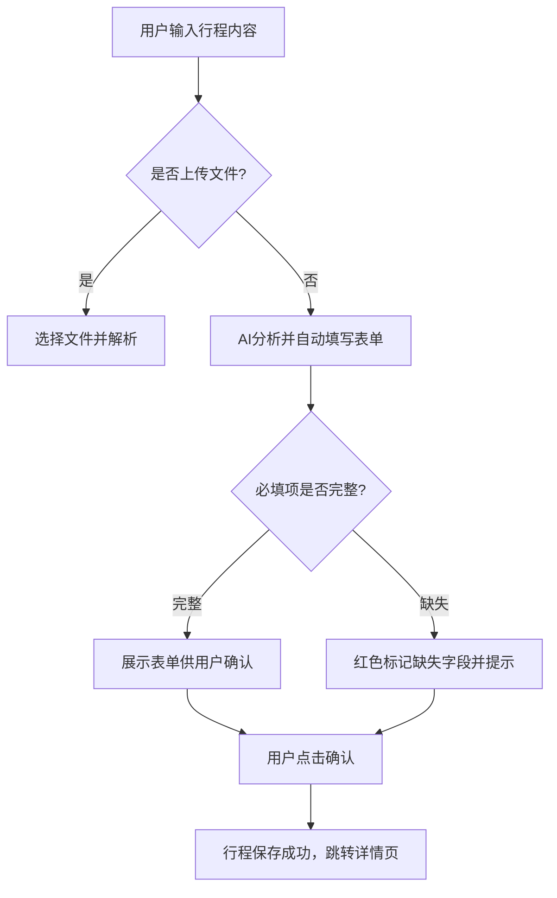

# Feature SPEC
> 描述功能实现细节，保持唯一性和可复用性

---

## 1. 基本信息
- **Feature ID**: 唯一标识符，例如 `TRIP_NEW_001`
- **Feature 名称**: 简短描述，例如 `新建行程页`
- **模块归属**: 例如 `行程管理`
- **优先级**: 高/中/低
- **负责人**: 前端/后端/AI agent
- **版本**: 1.0
- **创建日期**: YYYY-MM-DD
- **更新日期**: YYYY-MM-DD
- **状态**: 草稿 / 审核中 / 完成 / 已上线

---

## 2. 功能描述
- **简述**: 用一句话概括功能
- **详细说明**: 包含业务逻辑、约束条件
- **目标用户行为**: 用户在此页面的动作和预期结果
- **异常处理**: 异常场景及对应处理方式

---

## 3. 页面信息（可复用）
- **页面名称**: 例如 `新建行程页`
- **页面类型**: 主页面 / 弹窗 / 浮层 / Tab
- **入口**: 首页按钮 / 底部Tab / 推送跳转等
- **跳转目标**: 例如 `行程详情页`
- **页面状态**: 正常 / 加载中 / 禁用 / 错误
- **布局信息**:
  - 顶部、主体、底部
  - 模块及顺序
  - 样式/高亮/禁用等视觉表现

---

## 4. 输入与输出
- **输入字段**
| 字段名 | 类型 | 必填 | 说明 | 验证规则 |
|--------|------|------|------|---------|
| 目的地 | 文本+地图选点 | 必填 | 用户行程目的地 | 不为空，长度<=50 |
| 出发日期 | 日期选择器 | 必填 | 行程开始时间 | >=今天 |
| 返回日期 | 日期选择器 | 必填 | 行程结束时间 | >=出发日期 |
| 同行成员 | 多选 | 选填 | 添加联系人 | 无格式限制 |
| 预算范围 | 数字区间 | 选填 | 预计花费 | 上限100万 |
| 特殊需求 | 多选标签 | 选填 | 无障碍、儿童、老人等 | 无限制 |

- **输出/结果**
| 输出对象 | 类型 | 说明 |
|-----------|------|------|
| 行程表单 | 表单对象 | 完整行程信息 |
| Toast提示 | UI组件 | 成功/失败/提示 |
| AI分析结果 | JSON | 自动填写字段、推荐信息 |

---

## 5. 交互流程
- 使用步骤编号或 Mermaid 流程图
- **示例**


* **状态描述**

  * 正常状态：表单全部填写
  * 缺失状态：红色*提示
  * 加载状态：AI分析中，转圈动画
  * 异常状态：网络失败，提示重试

---

## 6. UI规范（可引用全局Code Style）

* **组件类型**: 按钮、输入框、卡片、Tab
* **按钮状态**: 默认/按下/禁用/加载中
* **Toast提示**: 成功/失败/提示
* **弹窗规范**: 二次确认，左取消右确认
* **颜色、间距、字体**: 可引用 global style guide
* **可操作/不可操作状态**: 需明确标注

---

## 7. 数据与接口

* **调用API**
  | 接口名称 | 请求方式 | URL | 请求参数 | 返回值 | 错误处理 |
  |----------|----------|-----|---------|--------|---------|
  | 新建行程 | POST | /trip/create | 表单字段JSON | 成功/失败状态 | 网络失败重试，提示Toast |

* **数据流向**

  * 页面输入 → Agent/后端 → 返回分析结果 → 页面渲染

* **本地存储**

  * 离线保存字段
  * 草稿箱缓存规则

---

## 8. AI agent 协作指令

* **输入**: Feature SPEC + API定义
* **行为约束**:

  * 禁止修改接口/路由/公共组件
  * 禁止新增全局依赖
  * 必须遵循 Code Style
* **自检规则**:

  * 确认必填字段存在
  * 确认异常场景已处理
  * 确认界面布局符合规范

---

## 9. 异常与边界条件

* 网络断开 → 离线缓存
* AI分析超时 → 提示重试
* 用户取消 → 草稿或丢弃
* 数据冲突 → 弹窗提示覆盖或加载最新

---

## 10. 测试用例（可选）

* **正常流程**: 填写完整行程 → 成功保存
* **异常流程**: 网络断开、必填项为空、日期冲突
* **边界条件**: 出发日期=返回日期，特殊字符输入

```


